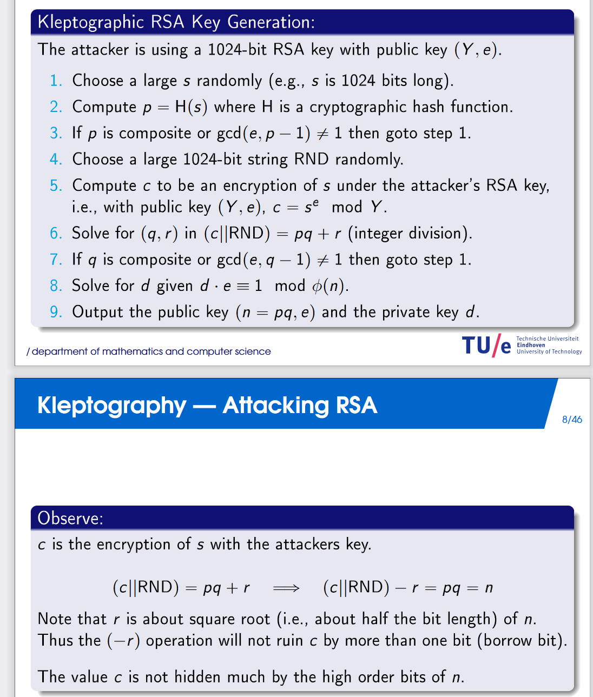

## flag

MOCSCTF{LOL_You_know_7he_RSA_Kl3pto}

## 解題步驟

1. 題目的RSA_key_generate產生了Klepto_RSA_key_generate函式用到的Y，那就先考慮如何分解Y。 這裡P和Q非常接近，利用費馬分解可以有效解決。

2. 拿到Y的分解下一步該去分析klepto過程：

```
def Klepto_RSA_key_generate(e,Y):
    while True:
        s = getRandomNBitInteger(1024)
        p = next_prime(int(sha256(str(s).encode()*4).hexdigest(),16))
        if isPrime(p):
            RND = getRandomNBitInteger(1024)
            c = pow(s,e,Y)
            tmp = long_to_bytes(c) + long_to_bytes(RND)
            tmp_ = bytes_to_long(tmp)
            q = tmp_ // p
            if isPrime(q):
                r = tmp_ % p
                n = p*q
                print(bin(n)[:1024+2])
                return n
            else:
                continue
```

這裡如果選手透過關鍵字能找到論文，那就照論文打就好：



如果沒找到就自己分析，這裡是通過生成了一個1023比特的隨機數s，然後對他做哈希來獲取素數p，然後利用Y來對s進行rsa加密，得到c，然後把c和另一個隨機數RND轉成字節連在一起作為tmp，然後用tmp除以p得到q，如果q為素數，那麼返回pxqn為素數，那麼返回pxqn。這裡的關鍵點在於RND最多1024比特，放在tmp的低點。這裡q=tmp//p，tmp = pxq+r，n=p*q，這裡n的高位大機率就是c了，因為r只影響低位。而我們又有Y的分解，可以透過c把s解出，再做哈希拿到p，q也得到了，整個系統就被破解了。

3. 透過p，q求私鑰d解rsa。


