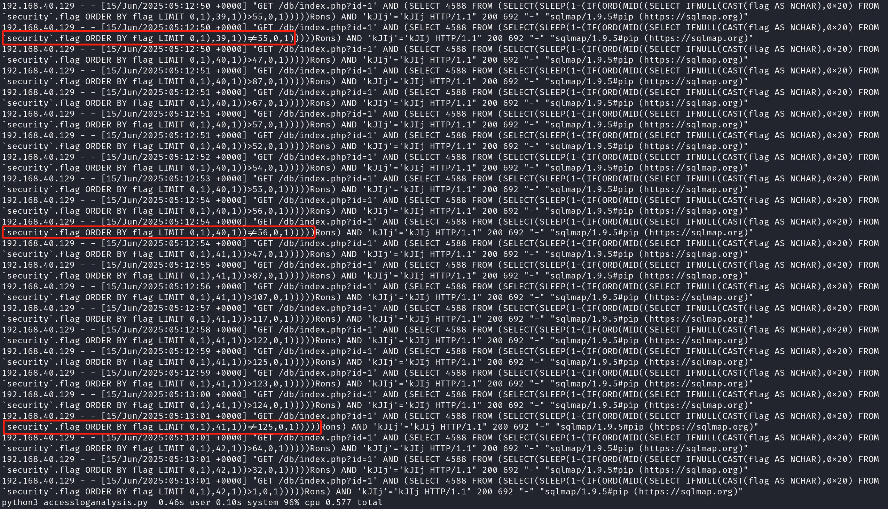
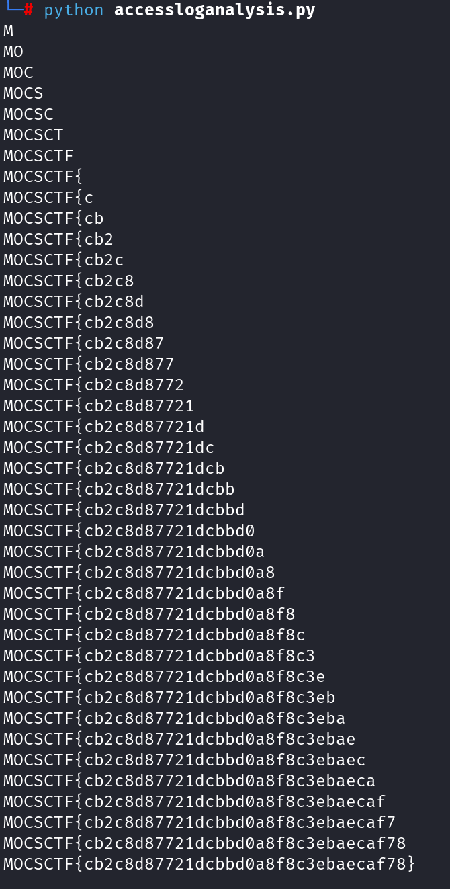

## flag

MOCSCTF{cb2c8d87721dcbbd0a8f8c3ebaecaf78}

## 解題步驟

題目給了apache2 的access 日誌。 url 解碼後，在日誌最後找到SQL 注入相關訪問記錄，根據訪問行為特徵判斷為盲注，UA 系那是為SQLmap 自動盲注。

此處SQLmap 在完成每個字節的盲注後多加了一次驗證，這次驗證嘗試的ascii 碼即為正確數值，這使題目難度大大降低。



編寫腳本，提取出每個字節盲注結束後的驗證數值作為ascii 碼，還原出flag。

```
from urllib.parse import unquote
import re

with open('./access.log') as f:
    c = unquote(f.read())
    # _re = re.findall('.*flag.*',c)
    pattern = 'flag ORDER BY flag LIMIT 0,1\),(\d+),1\)\)!=(\d+),'
    _re = re.findall(pattern,c)
    flag = ['' for i in range(42)]
    for i,a in _re:
        flag[int(i)] = chr(int(a))
        print(''.join(flag))

# MOCSCTF{cb2c8d87721dcbbd0a8f8c3ebaecaf78}
```

