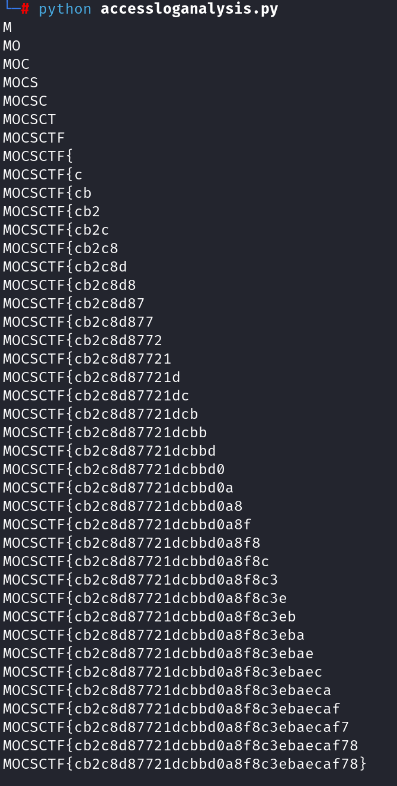

# easysqli

题目给了apache2 的access 日志。url 解码后，在日志最后找到SQL 注入相关访问记录，根据访问行为特征判断为盲注，UA 系那是为SQLmap 自动盲注。

此处SQLmap 在完成每个字节的盲注后多加了一次验证，这次验证尝试的ascii 码即为正确数值，这使题目难度大大降低。


编写脚本，提取出每个字节盲注结束后的验证数值作为ascii 码，还原出flag 。

```
from urllib.parse import unquote
import re

with open('./access.log') as f:
    c = unquote(f.read())
    # _re = re.findall('.*flag.*',c)
    pattern = 'flag ORDER BY flag LIMIT 0,1\),(\d+),1\)\)!=(\d+),'
    _re = re.findall(pattern,c)
    flag = ['' for i in range(42)]
    for i,a in _re:
        flag[int(i)] = chr(int(a))
        print(''.join(flag))

# MOCSCTF{cb2c8d87721dcbbd0a8f8c3ebaecaf78}
```

