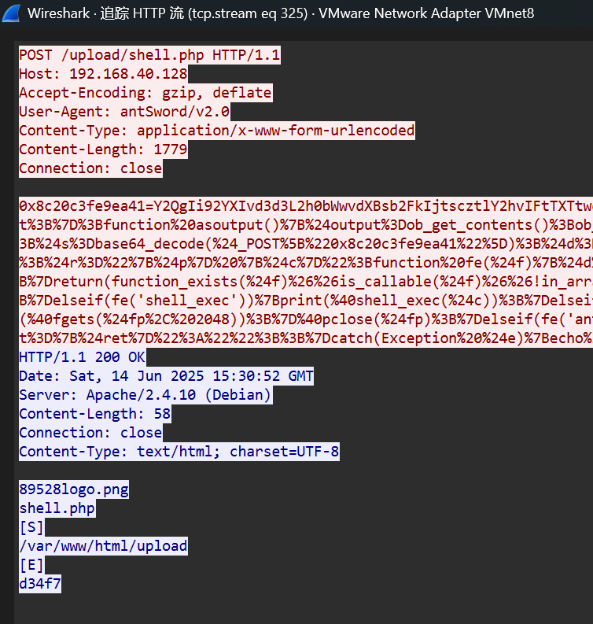
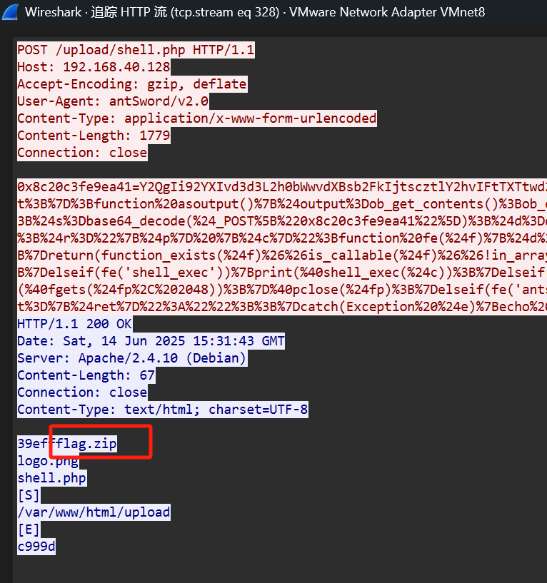
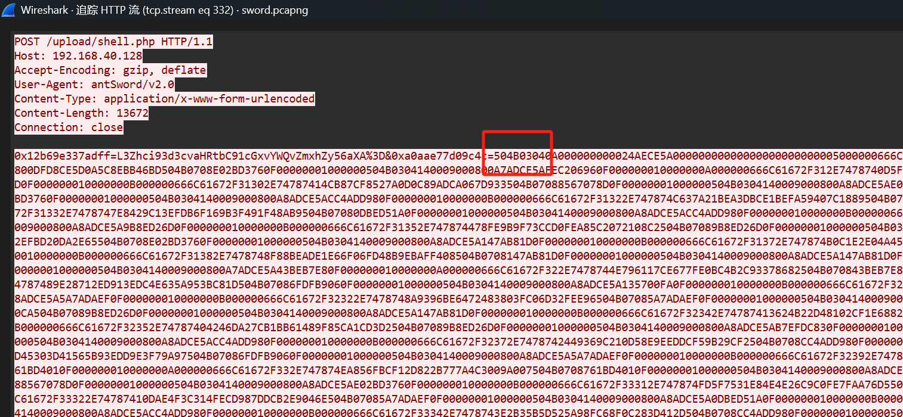
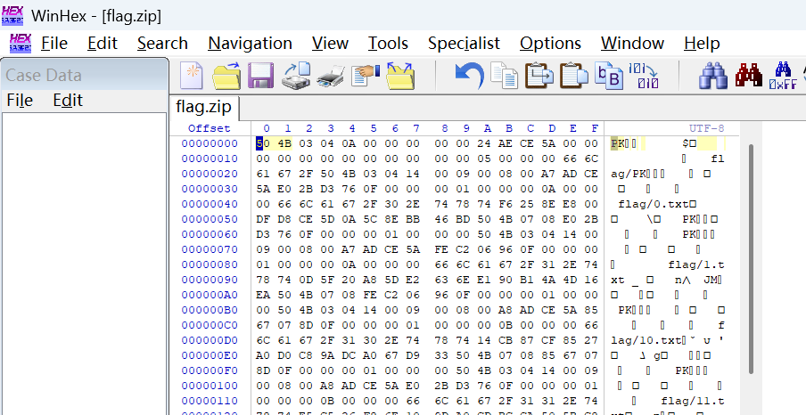

## flag

MOCSCTF{9fc0b9fd2d3f666c8e3631dce9fe2d4d}

## 解題步驟

1. WireShark 打開流量包，發現大量404 報文，說明攻擊者在掃描目錄。用以下過濾器隱藏GET 請求、404 和403 響應，發現剩下的報文已經很少，可以逐個手動分析。

```
((!(http.request.method == "GET")) && !(http.response.code == 404) and http) && !(http.response.code == 403)
```


2. 第一個包訪問/up/index.php 利用任意文件上傳漏洞上傳了一句話木馬。


3. 後面是用蟻劍連接一句話木馬做的一系列操作。






4. 發現兩個列舉文件目錄的明文響應，第二個增加了文件flag.zip，兩個HTTP 流之間有一個明顯的大的http 流，應該是用蟻劍上傳了flag.zip。雖然蟻劍的邏輯比較複雜且有BASE64 編碼，但畢竟不像冰蠍、哥斯拉有加密，此處可明顯看到Zip 文件頭504B0304：



5. 用Winhex 編輯器將這些16 進製字符寫入文件，還原出flag.zip



6. 用WinRAR 打開壓縮包，內有41 個文件，有加密，但每個文件大小為1 字節，有CRC32 校驗值。


由此可知，每個文件內有flag 中的一個字節，暴力破解CRC32 即可：

```
import zipfile
from binascii import crc32

flag = ''
_zipfile = zipfile.ZipFile('./flag.zip')
for i in range(41):
    _crc = _zipfile.getinfo('flag/{}.txt'.format(str(i))).CRC
    for j in range(32,127):
        if(crc32(chr(j).encode()) == _crc):
           flag += chr(j)
           print(flag)
           break 

# MOCSCTF{9fc0b9fd2d3f666c8e3631dce9fe2d4d}
```

7. 得到flag ：MOCSCTF{9fc0b9fd2d3f666c8e3631dce9fe2d4d}

