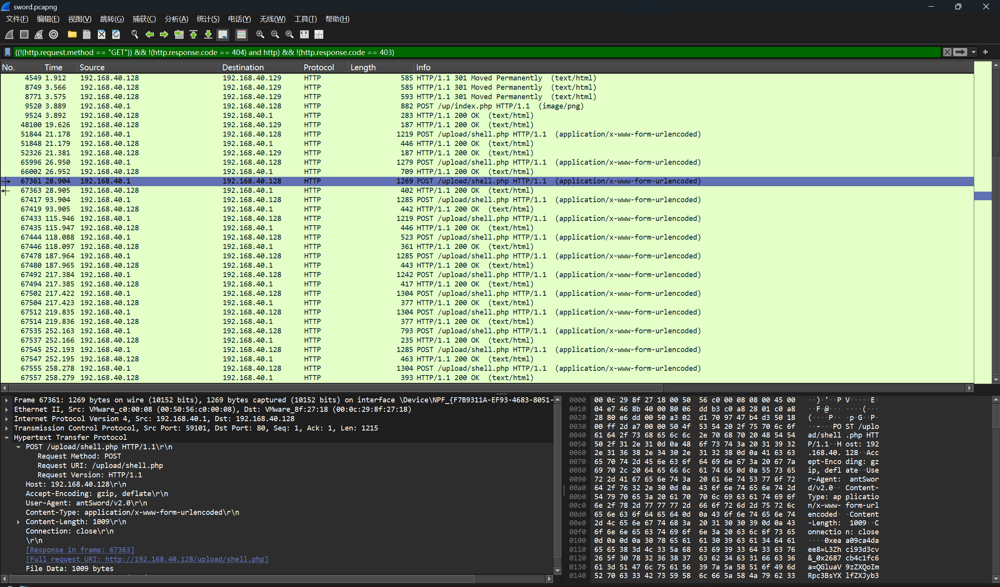
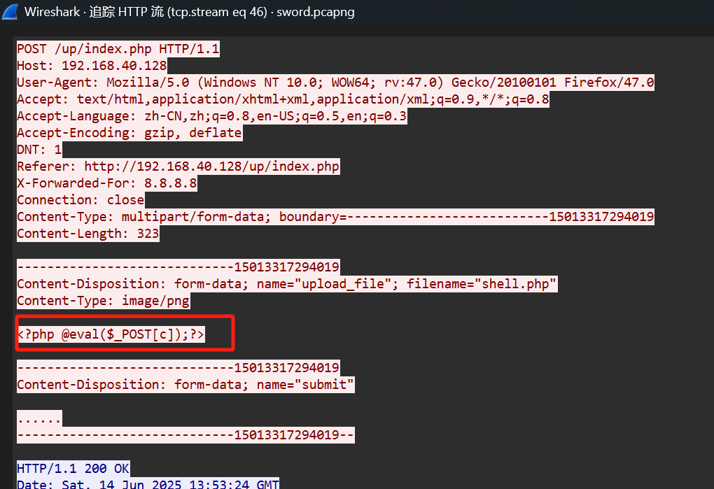
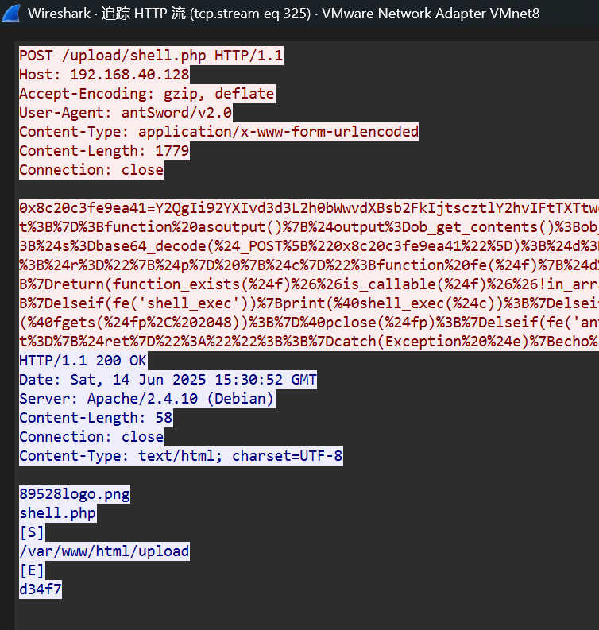
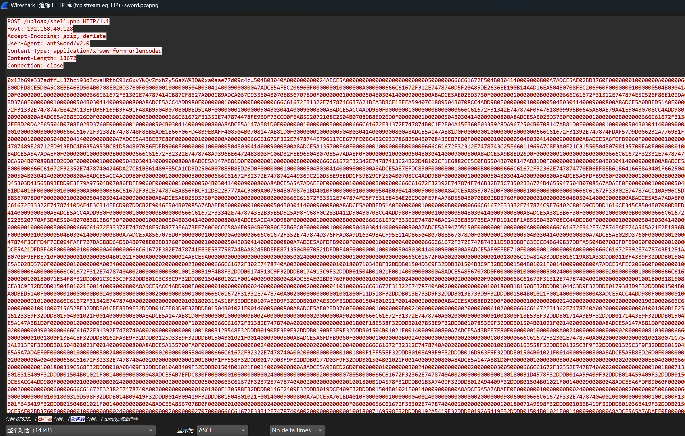
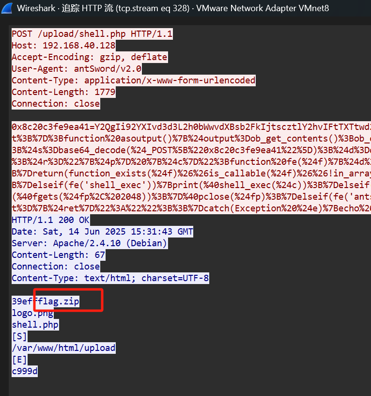
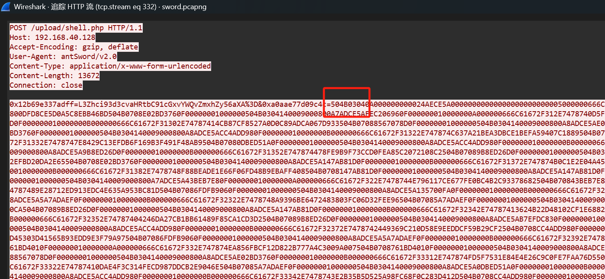
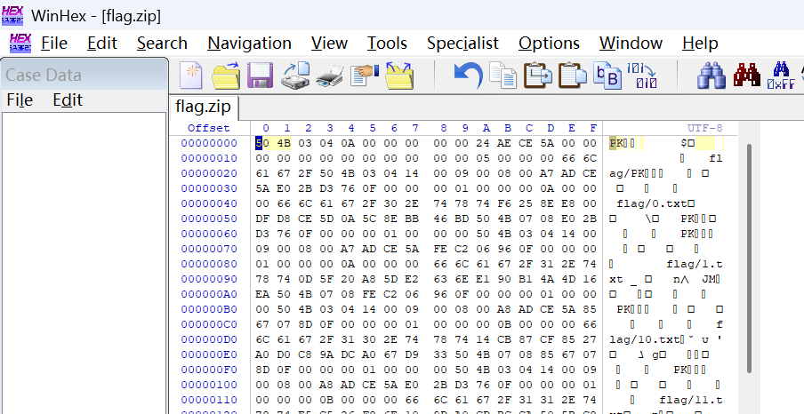
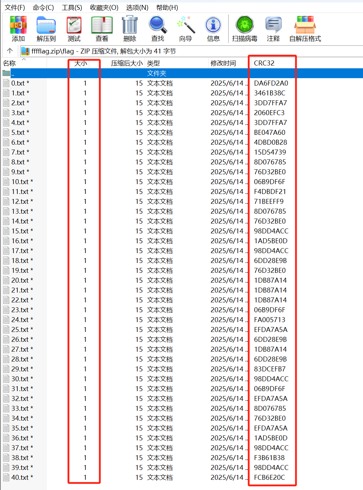
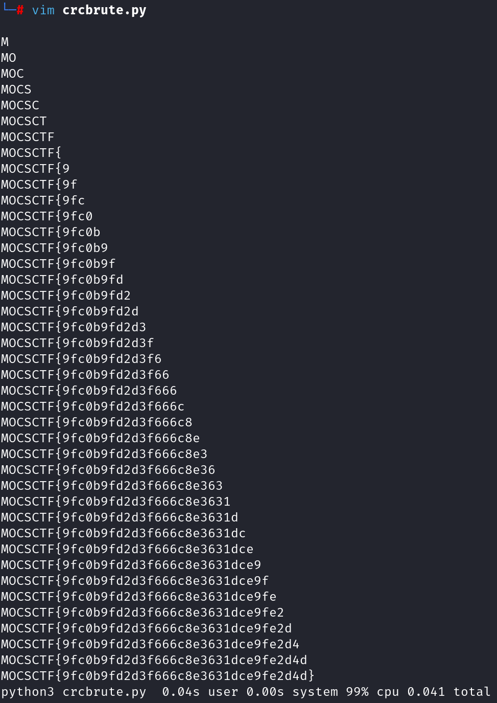

# EasySword

WireShark 打开流量包，发现大量404 报文，说明攻击者在扫描目录。用以下过滤器隐藏GET 请求、404 和403 响应，发现剩下的报文已经很少，可以逐个手动分析。

```
((!(http.request.method == "GET")) && !(http.response.code == 404) and http) && !(http.response.code == 403)
```



第一个包访问/up/index.php 利用任意文件上传漏洞上传了一句话木马。



后面是用蚁剑连接一句话木马做的一系列操作。







发现两个列举文件目录的明文响应，第二个增加了文件flag.zip，两个HTTP 流之间有一个明显的大的http 流，应该是用蚁剑上传了flag.zip。

虽然蚁剑的逻辑比较复杂且有BASE64 编码，但毕竟不像冰蝎、哥斯拉有加密，此处可明显看到Zip 文件头504B0304：



用Winhex 编辑器将这些16 进制字符写入文件，还原出flag.zip



用WinRAR 打开压缩包，内有41 个文件，有加密，但每个文件大小为1 字节，有CRC32 校验值。



由此可知，每个文件内有flag 中的一个字节，暴力破解CRC32 即可：

```
import zipfile
from binascii import crc32

flag = ''
_zipfile = zipfile.ZipFile('./flag.zip')
for i in range(41):
    _crc = _zipfile.getinfo('flag/{}.txt'.format(str(i))).CRC
    for j in range(32,127):
        if(crc32(chr(j).encode()) == _crc):
           flag += chr(j)
           print(flag)
           break 

# MOCSCTF{9fc0b9fd2d3f666c8e3631dce9fe2d4d}
```

得到flag ：MOCSCTF{9fc0b9fd2d3f666c8e3631dce9fe2d4d}

