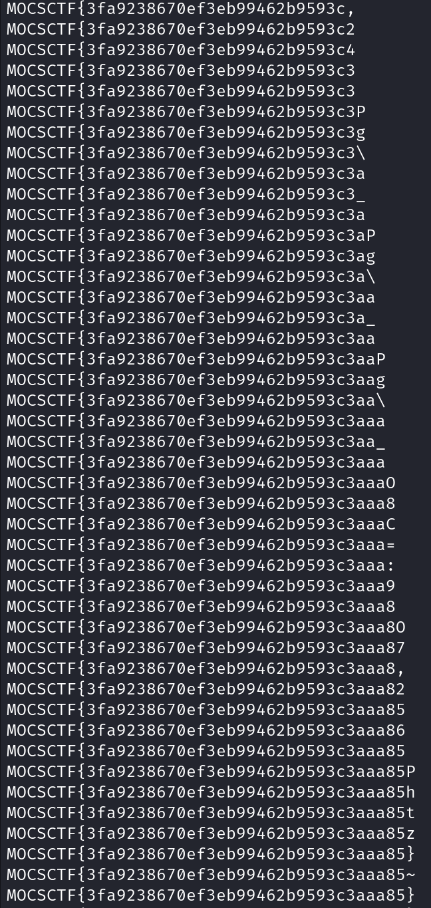

## flag

MOCSCTF{3fa9238670ef3eb99462b9593c3aaa85}

## 解題步驟

1. 打開附件pcap 文件，在文件後部發現SQL 注入流量，且所有響應包大小相同，符合延時盲注特徵。


2. 使用tshark 命令過濾http 請求和響應包，並導出時間、uri 等字段到out.txt

```
tshark -r midsqli.pcap -T fields -e "frame.time_relative" -e http.request.full_uri -Y "http.request or http.response" > out.txt
```

3. 編寫腳本，使用正則表達式提取與盲注flag 表的flag 字段相關的數據，包括請求時間、請求uri 中的字符串下標和嘗試的ascii 碼、響應時間。根據響應時間與請求時間的差值判斷是否延時，結合二分法特性，恢復出flag 的值。

```
from urllib.parse import unquote
import re

flag = ['' for i in range(50)]
with open('out.txt') as f:
    c = unquote(f.read())
    pattern = '(\d+\.\d+)\s+.+,(\d+),1\)\)>(\d+)\),1\)\)-- '
    _re = re.findall(pattern,c)
    for i in range(0,len(_re),1):
        reqtime,_index,_ascii = _re[i]
        restime = _re[i+1][0]
        interv = float(restime) - float(reqtime)
        if(interv > 0.5):
            flag[int(_index)] = chr(int(_ascii) + 1)
            print(''.join(flag))
        else:
            flag[int(_index)] = chr(int(_ascii))
            print(''.join(flag))

# MOCSCTF{3fa9238670ef3eb99462b9593c3aaa85}
```

