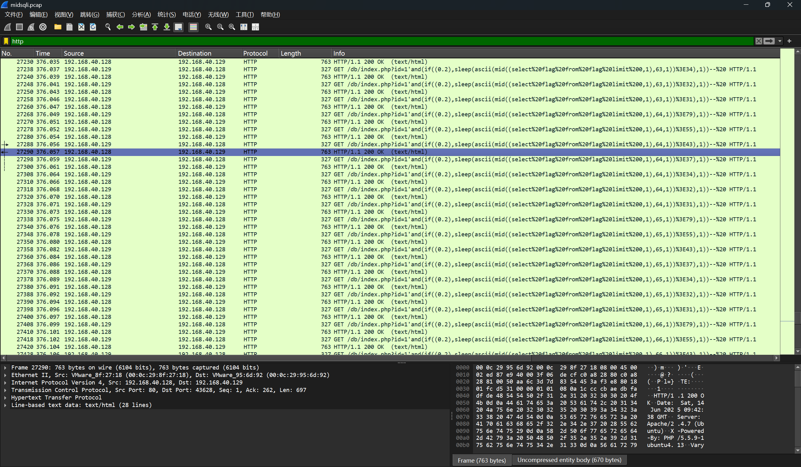
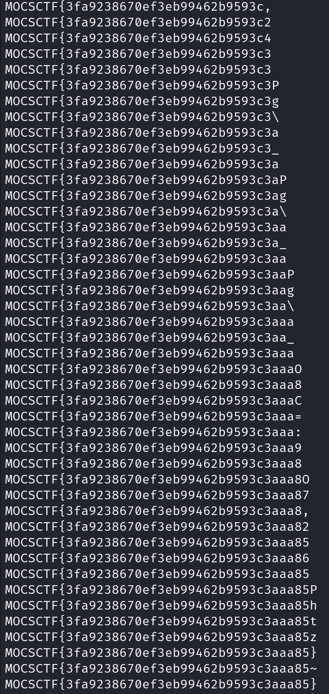

# MidSQLi

打开附件pcap 文件，在文件后部发现SQL 注入流量，且所有响应包大小相同，符合延时盲注特征。



使用tshark 命令过滤http 请求和响应包，并导出时间、uri 等字段到out.txt 

```
tshark -r midsqli.pcap -T fields -e "frame.time_relative" -e http.request.full_uri -Y "http.request or http.response" > out.txt
```

编写脚本，使用正则表达式提取与盲注flag 表的flag 字段相关的数据，包括请求时间、请求uri 中的字符串下标和尝试的ascii 码、响应时间。根据响应时间与请求时间的差值判断是否延时，结合二分法特性，恢复出flag 的值。

```
from urllib.parse import unquote
import re

flag = ['' for i in range(50)]
with open('out.txt') as f:
    c = unquote(f.read())
    pattern = '(\d+\.\d+)\s+.+,(\d+),1\)\)>(\d+)\),1\)\)-- '
    _re = re.findall(pattern,c)
    for i in range(0,len(_re),1):
        reqtime,_index,_ascii = _re[i]
        restime = _re[i+1][0]
        interv = float(restime) - float(reqtime)
        if(interv > 0.5):
            flag[int(_index)] = chr(int(_ascii) + 1)
            print(''.join(flag))
        else:
            flag[int(_index)] = chr(int(_ascii))
            print(''.join(flag))

# MOCSCTF{3fa9238670ef3eb99462b9593c3aaa85}
```

