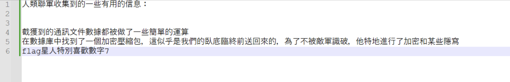
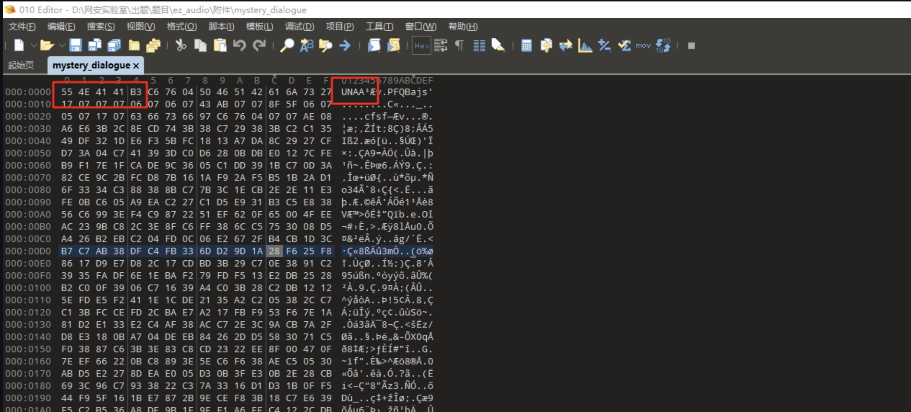
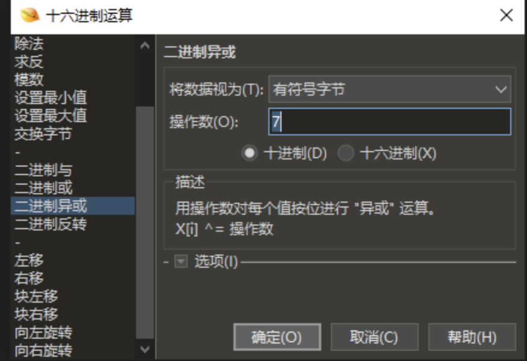
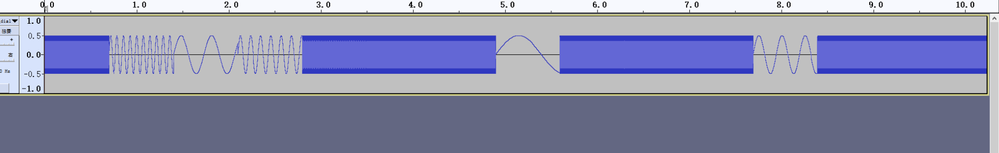
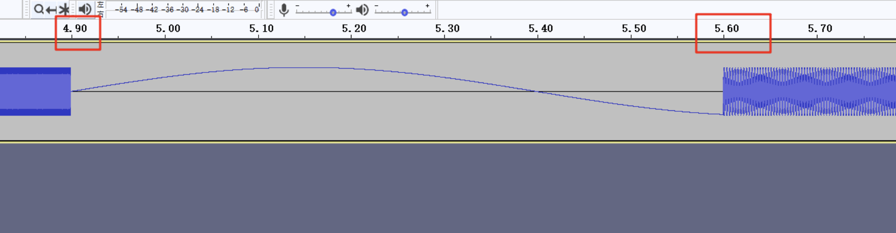
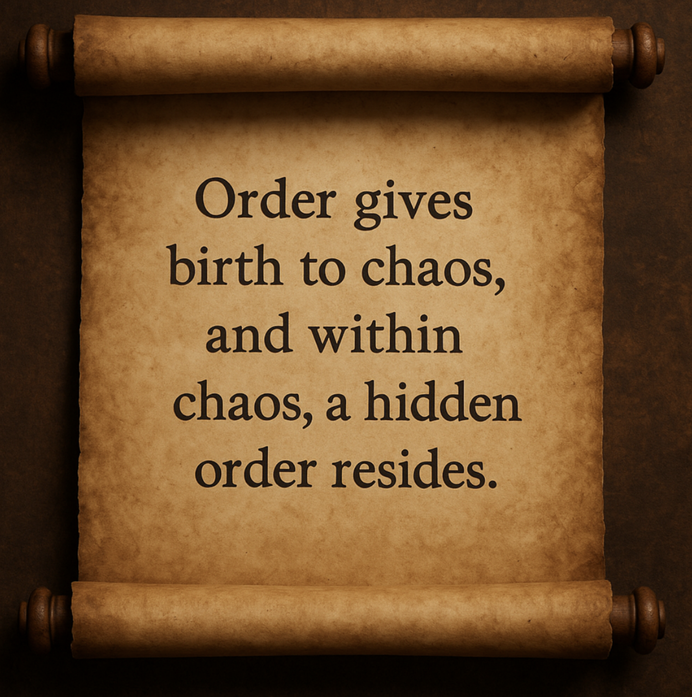
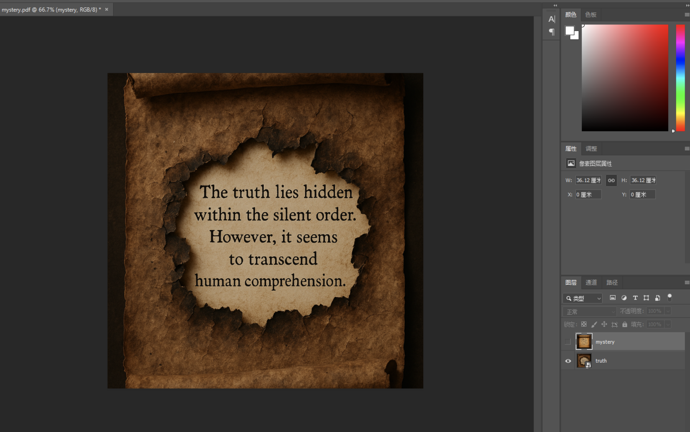
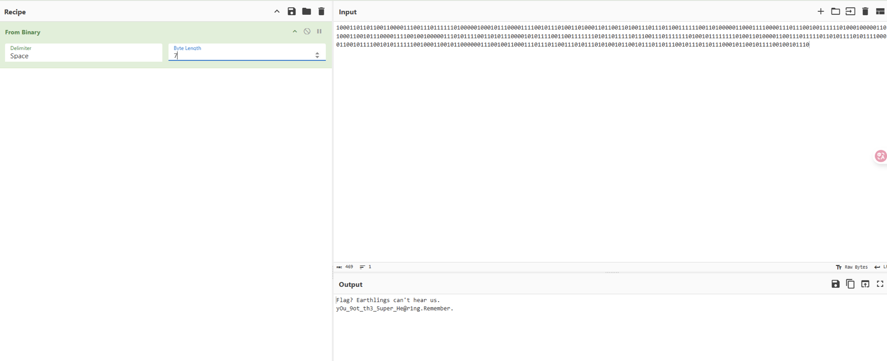

## flag

MOCSCTF{yOu_9ot_th3_5uper_He@r1ng}

## 解題步驟

1. 其中文檔給了一些簡單的hint，我們可以知道flag星人喜歡十進製的7；壓縮包及內容被處理了；通訊文件數據做了簡單的運算，那麼就能推斷出三個信息，後續肯定有關於7的用處；需要處理壓縮包；我們需要對通訊文件的處理恢復一下



2. 用010查看一下通訊文件的具體情況，首先根據題目，不難猜出這原本應該是一個音頻文件，那麼常見的音頻文件有比如wav，mp3，而他們的文件頭分別是RIFF和ID3。分析這個通訊文件，雖然它並不沒有明顯的文件頭，但可以看出來它的格式為ABCC式，這恰恰對應了wav的文件頭RIFF的格式，所以可以推斷出原本的文件是wav文件

而且題目中也說了簡單的運算，而運算我們常見的幾種就是與，或，異或…… 

那麼要運算多少位呢，實際上這裏就用到了文檔中的提示，要跟7進行運算



3. 結合上面的信息，簡單的嘗試後就能得到是要對文件進行異或操作，而操作數則是7



4. 而打開壓縮包 ，直接爆破即可，密碼為1264

5. 解壓後得到一個文件，用010打開簡單分析可以發現是一個倒置的pdf文件，用工具或腳本簡單處理一下即可
```
python FileReverse-Tools.py -r mystery
```
6. 用010打開inversion.bin，另存為pdf

7. 這邊先對音頻進行分析，用audacity打開，稍微放大可以看到裏面有各種各樣奇怪的波形



8. 對其中的波形放大後，可以發現同一種波形的持續時間是0.7s（與提示第一條相對應），除此之外似乎並沒有明顯的規律



9. 再來看看提出來的pdf，裏面是一張圖片，圖片中給了提示"Order gives birth to chaos, and within chaos, a hidden order resides"，這似乎告訴我們在混亂的波形中藏了穩定的信息，但可能還是無從下手（當然了如果您僅靠這層提示就解出來了，是真的很厲害）



10. 事實上這裏是pdf多圖層隱寫，將pdf丟進ps可以發現下面還藏了一個圖層，這個圖層告訴我們"The truth lies hidden within the silent order. However, it seems to transcend human comprehension"，這裏有兩個關鍵提示，一個是真理潛藏在無聲的秩序中，也就是需要留意沒有聲音的部分，而第二個提示則是暗示我們需要關註人類無法理解的部分。這裏其實是考察了一個熱知識：人耳能夠聽到的頻率在20hz~20000hz，在這個範圍外的聲音，人耳是無法聽到的，這也就形成了即便有波形但是我們聽起來卻是靜音的情況，對應了人類無法理解



11. 至此得到的信息其實已經比較充足了，顯然我們需要去分析不在20hz~20000hz這個範圍內的波形，問題在於怎麽分析呢？

12. 這裏可以用腳本將音頻按照每0.7s進行切割，然後檢測每一段波形的頻率，將所有不在可聽範圍的波形頻率按順序輸出，去分析他的規律。其實不難發現會出現兩種類型的頻率，一種是低於20hz的頻率，一種則是高於20000hz的頻率，而兩種頻率，正對應著01，也就是我們最熟悉的二進製

這裏給出解析的腳本

```python
import wave
import numpy as np
from scipy.fft import fft, fftfreq

filename = 'mystery_sound.wav'
sum = ''
with wave.open(filename, 'rb') as wf:
    sample_rate = wf.getframerate()
    num_frames = wf.getnframes()
    audio_data = np.frombuffer(wf.readframes(num_frames), dtype=np.int16)


duration_per_segment = 0.7 # 每段0.7秒
samples_per_segment = int(sample_rate * duration_per_segment)

# 分段分析
num_segments = len(audio_data) // samples_per_segment

for i in range(num_segments):
    segment = audio_data[i * samples_per_segment : (i + 1) * samples_per_segment]

    fft_result = np.abs(fft(segment))
    freqs = fftfreq(len(segment), d=1/sample_rate)

    positive_freqs = freqs[:len(freqs)//2]
    positive_magnitudes = fft_result[:len(fft_result)//2]

    peak_freq = positive_freqs[np.argmax(positive_magnitudes)]

    if peak_freq < 20:
        sum = sum+'0'
        print(f'第{i + 1}段: 主頻率 = {peak_freq:.2f} Hz → bit = 0')
    elif peak_freq > 20000:
        sum = sum+'1'
        print(f'第{i + 1}段: 主頻率 = {peak_freq:.2f} Hz → bit = 1')
    else:
        print(f'第{i + 1}段: 主頻率 = {peak_freq:.2f} Hz → bit = ?')


print(sum)
print(len(sum))
```

13. 成功將音頻轉為01字符串後，用廚子轉換成ascii值即可，不過不要忘了flag星人喜歡7哦（七位長度的二進製字符串）

14. 然後就可以解出flag星人的對話，從中獲得神之flag



