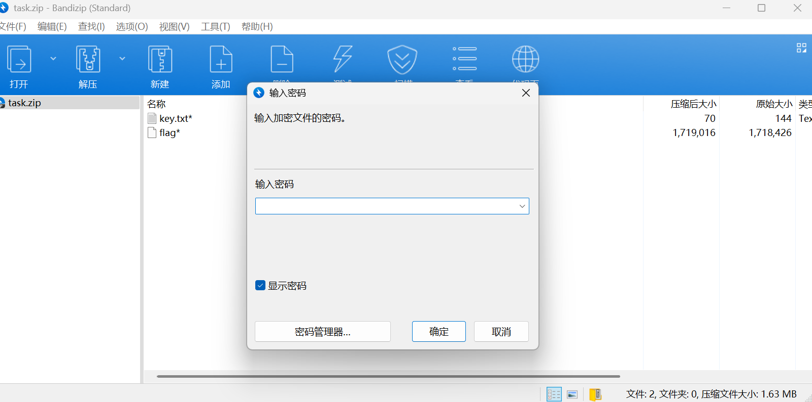
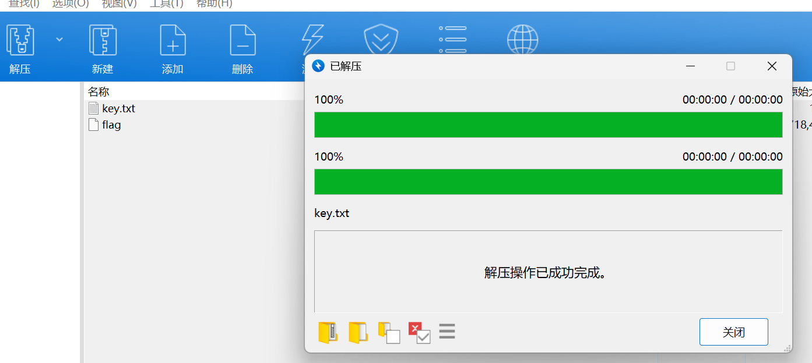
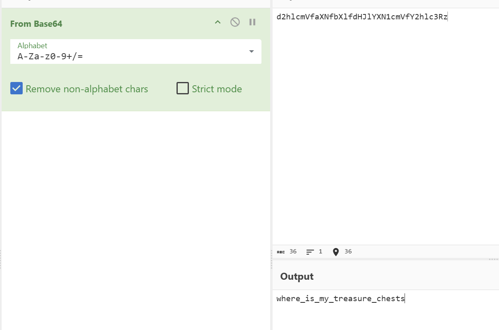
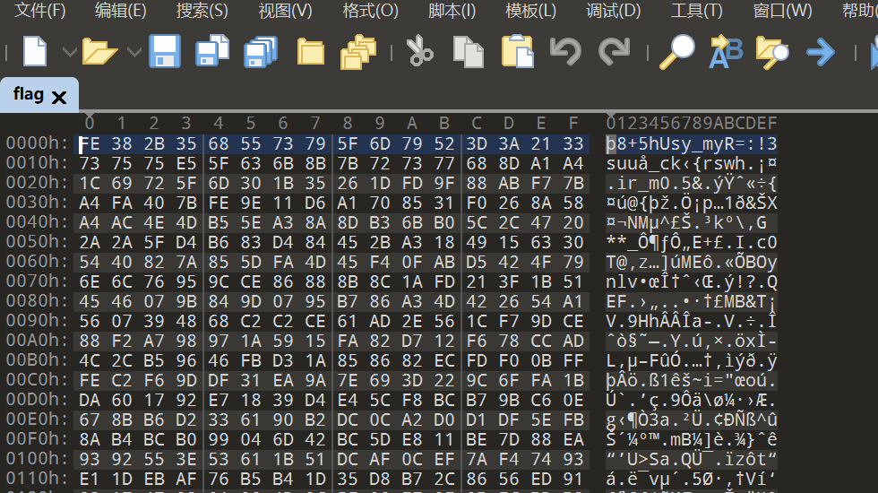
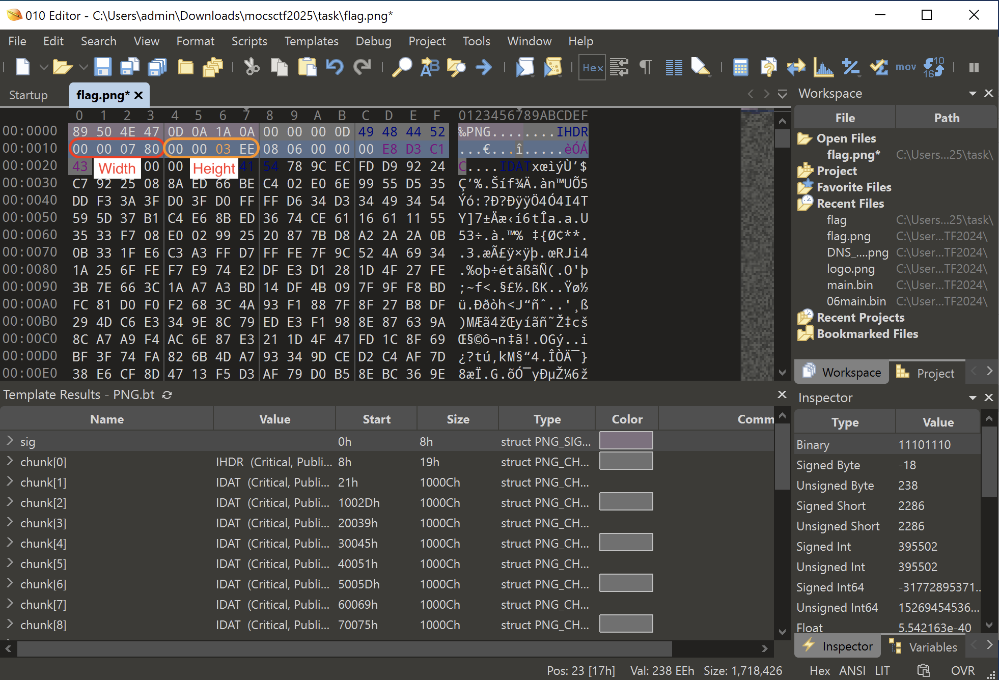
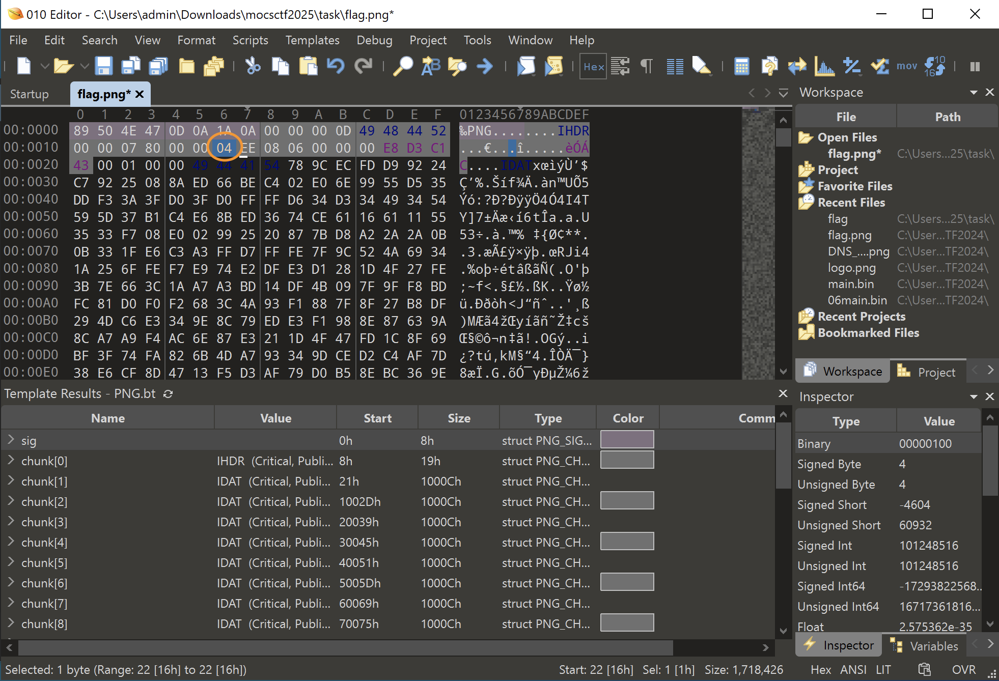
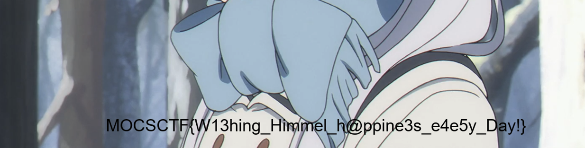

## flag

MOCSCTF{W13hing_Himmel_h@ppine3s_e4e5y_Day!}

## 解題步驟



1. 要密碼解壓縮這裡進行了偽加密，然後可以用ZipCenOp攻擊解密

```powershell
java -jar ZipCenOp.jar r task.zip
success 2 flag(s) found
```



2. 可以正常解壓縮，然後查看key.txt內容

```plain
👛🐩👟👣👚👤👍👝👘👏👅👝👙👏👣👝👛🐿👁👣👐👏👅🐨👚👤👍👝👐🐩👟👣👚🐪👉👱
```

3. 考察base100+base64

https://ctf.bugku.com/tool/base100

```
d2hlcmVfaXNfbXlfdHJlYXN1cmVfY2hlc3Rz
```



```
where_is_my_treasure_chests
```

4. 使用010editor進行查看



可以透過比較發現

```bash
[ 0] Enc: FE ⊕ Key: 77 (w) = Dec: 89 (.)
[ 1] Enc: 38 ⊕ Key: 68 (h) = Dec: 50 (P)
[ 2] Enc: 2B ⊕ Key: 65 (e) = Dec: 4E (N)
[ 3] Enc: 35 ⊕ Key: 72 (r) = Dec: 47 (G)
[ 4] Enc: 68 ⊕ Key: 65 (e) = Dec: 0D (.)
[ 5] Enc: 55 ⊕ Key: 5F (_) = Dec: 0A (.)
[ 6] Enc: 73 ⊕ Key: 69 (i) = Dec: 1A (.)
[ 7] Enc: 79 ⊕ Key: 73 (s) = Dec: 0A (.)
```

5. xor之後開頭是png頭，那麼可以寫一個腳本來對檔案進行xor轉化

```python
enc = open('flag', 'rb').read()
key = b'where_is_my_treasure_chests'
flag = []
for i in range(len(enc)):
    data = enc[i]^key[i%len(key)]
    flag.append(data)

flag = bytes(flag)

open('flag.png', 'wb').write(flag)
```


6. 這時候可以常看圖片的屬性這些資訊不難發現需要恢復原來的寬高的

7. 使用010 editor 改寬高




8. 儲存後就看到flag




