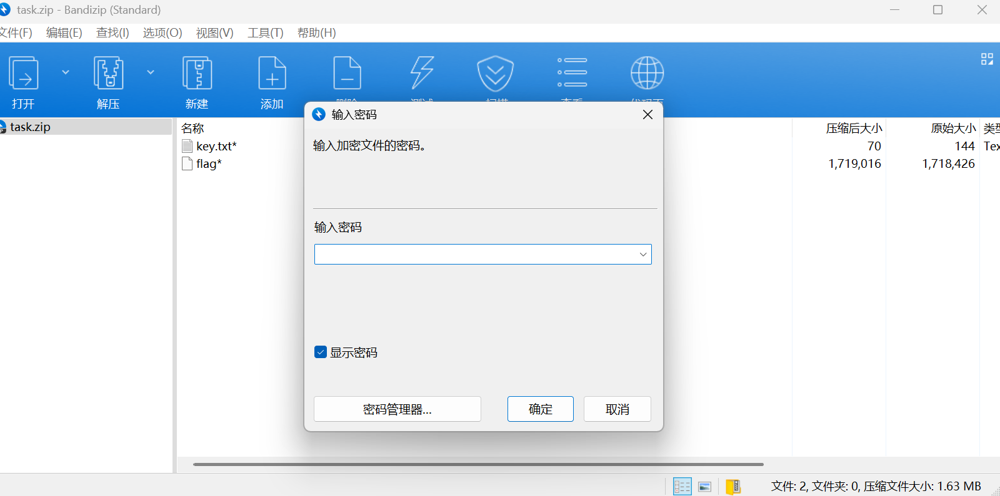
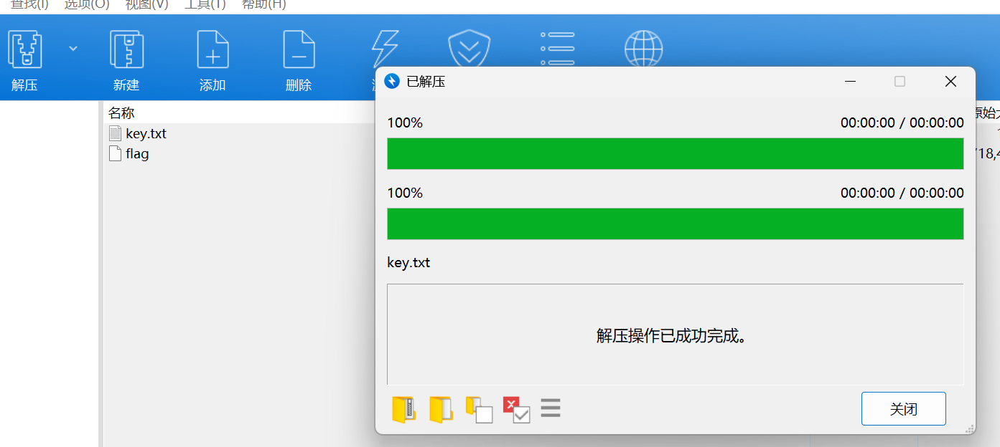
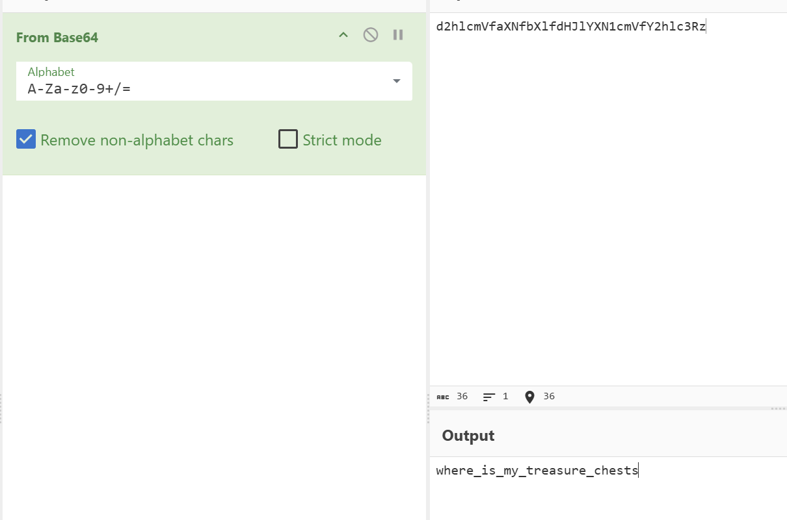
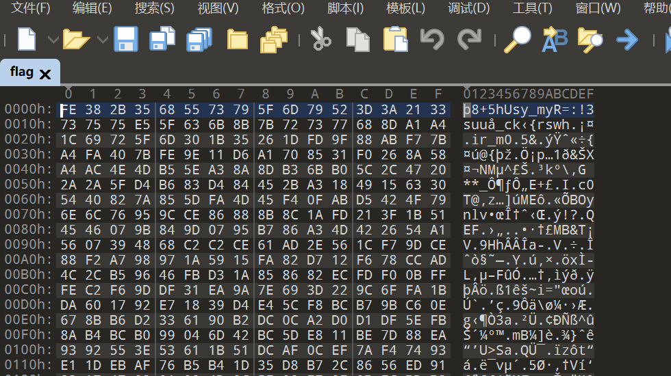
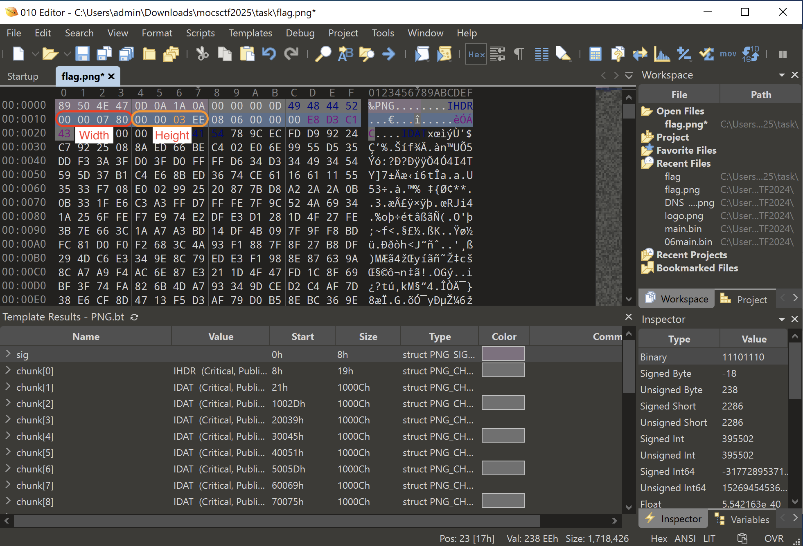
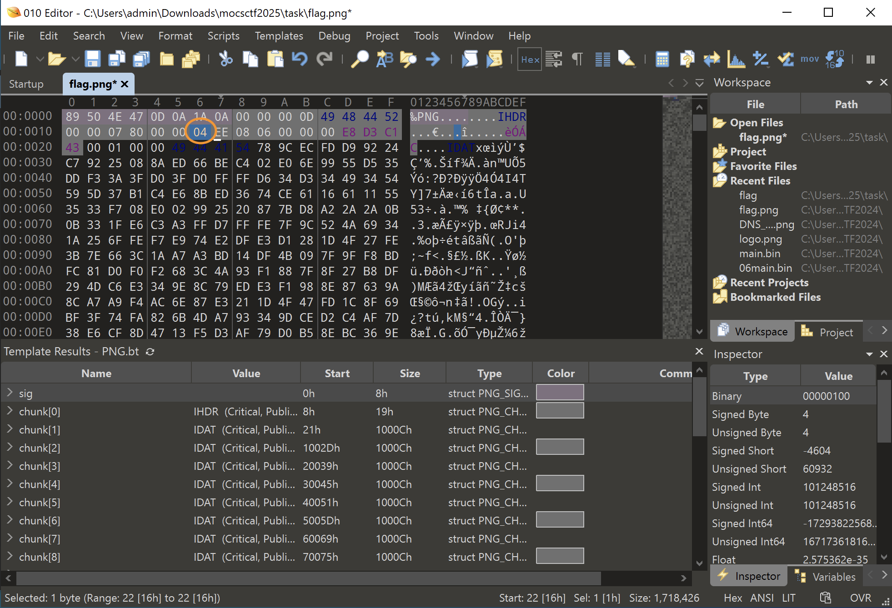
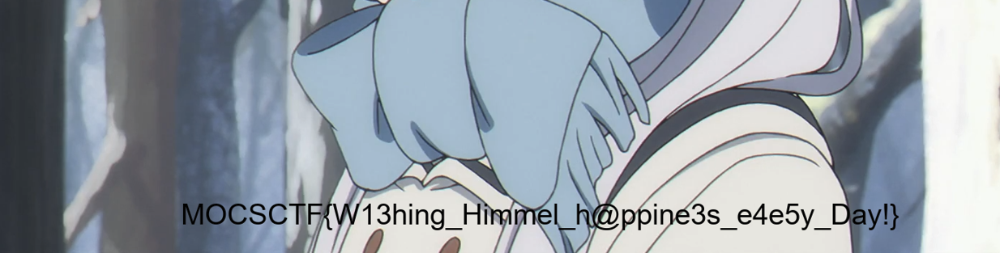

# Writeup



要密码解压这里进行了伪加密

可以用ZipCenOp攻击进行解密

```powershell
java -jar ZipCenOp.jar r task.zip
success 2 flag(s) found
```



可以正常解压

查看key.txt内容

```plain
👛🐩👟👣👚👤👍👝👘👏👅👝👙👏👣👝👛🐿👁👣👐👏👅🐨👚👤👍👝👐🐩👟👣👚🐪👉👱
```

考察base100+base64

https://ctf.bugku.com/tool/base100

```
d2hlcmVfaXNfbXlfdHJlYXN1cmVfY2hlc3Rz
```



```
where_is_my_treasure_chests
```

使用010editor进行查看



可以通过比较发现

```bash
[ 0] Enc: FE ⊕ Key: 77 (w) = Dec: 89 (.)
[ 1] Enc: 38 ⊕ Key: 68 (h) = Dec: 50 (P)
[ 2] Enc: 2B ⊕ Key: 65 (e) = Dec: 4E (N)
[ 3] Enc: 35 ⊕ Key: 72 (r) = Dec: 47 (G)
[ 4] Enc: 68 ⊕ Key: 65 (e) = Dec: 0D (.)
[ 5] Enc: 55 ⊕ Key: 5F (_) = Dec: 0A (.)
[ 6] Enc: 73 ⊕ Key: 69 (i) = Dec: 1A (.)
[ 7] Enc: 79 ⊕ Key: 73 (s) = Dec: 0A (.)
```

xor之后开头是png头，那么可以写一个脚本对文件进行xor转化

```python
enc = open('flag', 'rb').read()
key = b'where_is_my_treasure_chests'
flag = []
for i in range(len(enc)):
    data = enc[i]^key[i%len(key)]
    flag.append(data)

flag = bytes(flag)

open('flag.png', 'wb').write(flag)
```


这个时候可以常看图片的属性这些信息不难发现需要恢复原来的宽高的

使用010 editor 改宽高




儲存後就看到flag




```
MOCSCTF{W13hing_Himmel_h@ppine3s_e4e5y_Day!}
```

