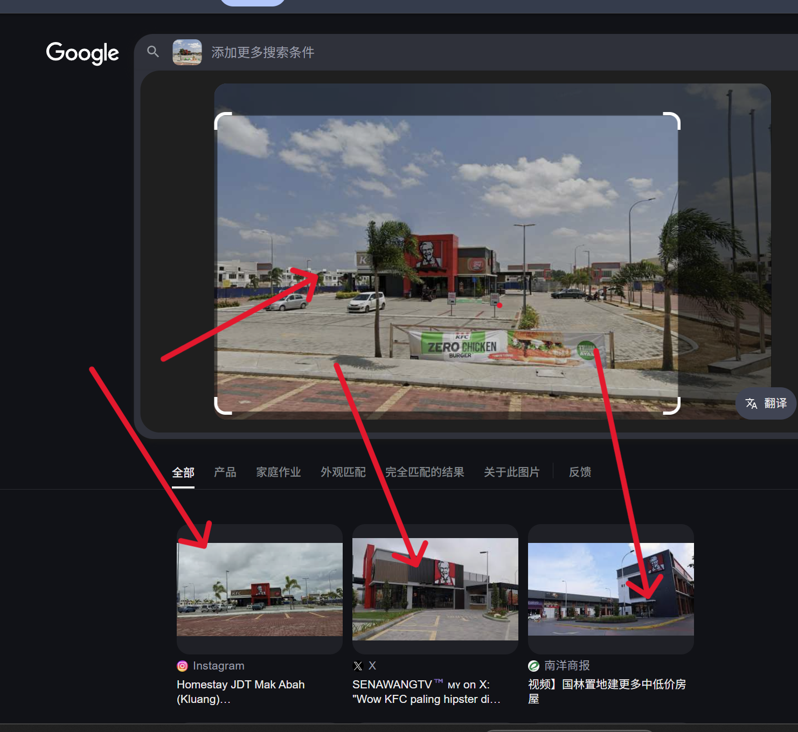
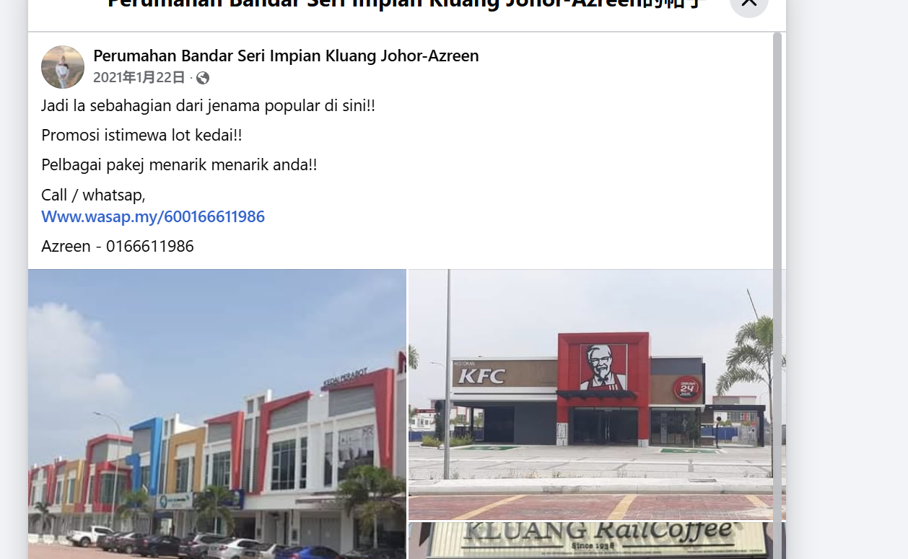
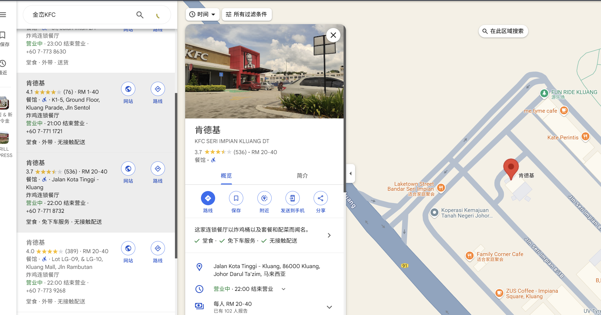
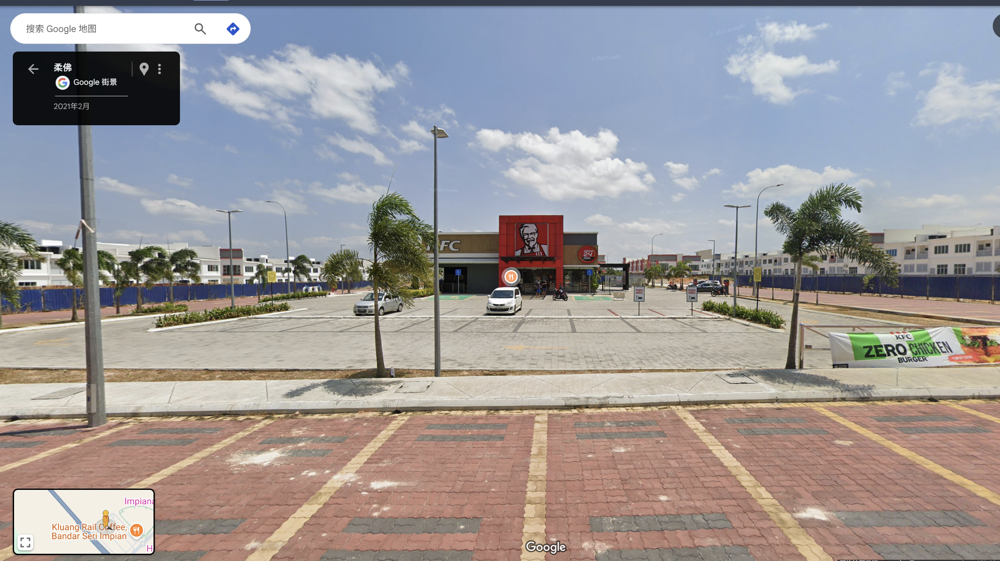
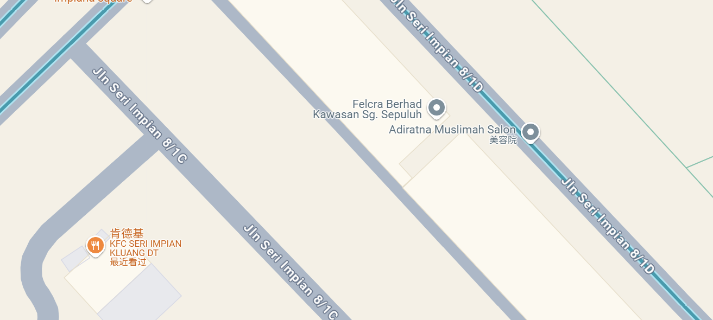

## flag

MOCSCTF{Adiratna_Muslimah_Salon}

## 解題步驟



1. 分析一下大致就確定下面報道，應該在一個國際，其中圖一肯定就是一個地方了

參考這個連結的內容

https://www.facebook.com/bandarseriimpiankluang/posts/jadi-la-sebahagian-dari-jenama-popular-di-sinipromosi-istimewa-lot-kedaipelbagai/4845311742206194/

2. 可以看到有KFC,同時知道附件建築的顏色



3. 同時可以透過這棟房子檢索到在[**金巒**](https://www.facebook.com/profile.php?id=100069465588265&__cft__[0]=AZVQfyHlUJUPPY9zDFJnlbCBn-OSDA3Xv8HWPcva_LoD-R9wSP05fQhaRt81z88MTj9FjpfYf7p_Wo07bL4WYZvBxuVc3tVZm_GKG5zPSUsSO0-aJum69KfAlk32qOec8f0o97ILwwuyZNUYJ6zeZ1FF5ujhhoh_fFvaL1mTFIR3jk3NrDYO5qN19zlxOmA5Euo)這個地方，那麼直接搜索







4. 定位到美容院，得到flag
```
MOCSCTF{Adiratna_Muslimah_Salon}
```

