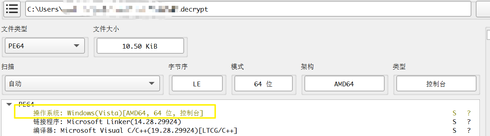

## flag

MOCSCTF{4829a5a29aebf281a7e1ba5e94a2e0bb}

## 解題步驟


1. 運行查看

執行程式查看，依序出現如下彈跳視窗 can you find the flag? 說明dll被劫持了；


檢視程式為x64，將exe檔拖曳到IDA，看導入表；程式自訂的導入dll如下；


2. 依序查看dll獲取key

- clipboard_watcher_plugin.dll

匯出表


查看函數，典型的白加黑測試；


返回看主函數


跟進


跟進，clipboard_watcher_plugin，第一個彈跳窗在這裡；


發現演算法和數據


進行異或的值


異或結果

```c
{0xB9, 0xF9, 0xB9, 0x6A, 0xA4}
```

依序跟進剩餘dll

- desktop_multi_window_plugin.dll


異或結果

```c
{0x9F, 0xF8, 0xD9, 0x25, 0x0C}

```

- flutter_webrtc_plugin.dll


異或結果

```c
{0x92, 0xF7, 0xD4, 0x2E, 0x09}

```

- screen_retriever_plugin.dll


異或結果

```c
{0xBA, 0xDF, 0xDC, 0x20, 0x09}

```

- window_manager_plugin.dll


異或結果

```c
{0xEA, 0xDF, 0xBC, 0x20, 0x59}
```

題目中有個encrypt文件，猜測是用key進行解密；這裡就是異或，不過異或key是上述連接；

```c
0xB9,0xF9,0xB9,0x6A,0xA4,0x9F,0xF8,0xD9,0x25,0x0C,0x92,0xF7,0x D4,0x2E,0x09,0xBA,0xDF,0xDC,0x20,0x09,0xEA,0xDF,0xBC,0x20,0x59
```

3. XOR解密encrypt文件


解密後查看文件發現是exe文件



執行或拖入IDA拿到flag


```
MOCSCTF{4829a5a29aebf281a7e1ba5e94a2e0bb}
```


