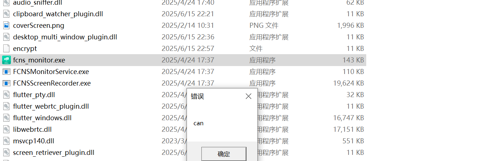
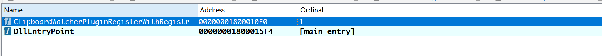
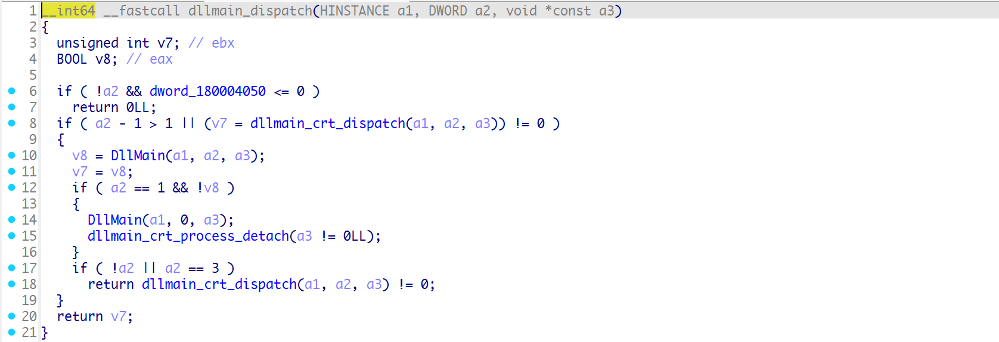
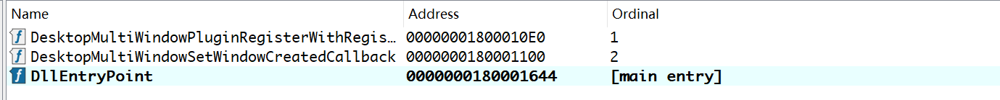
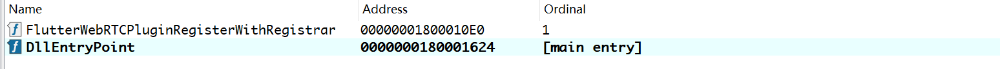
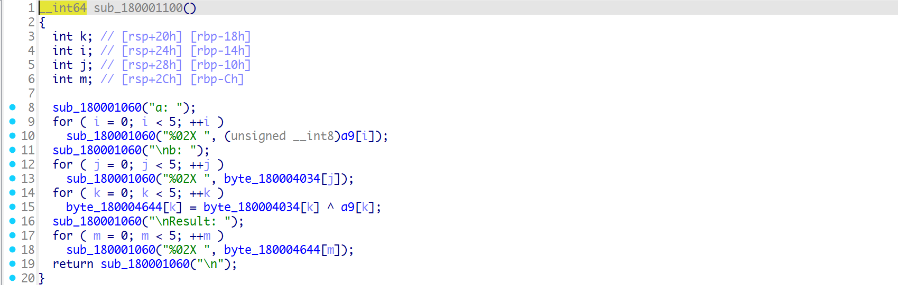
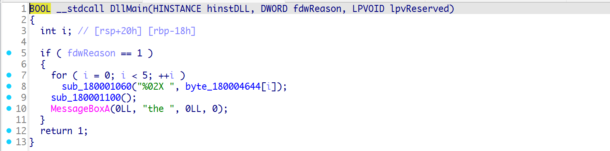
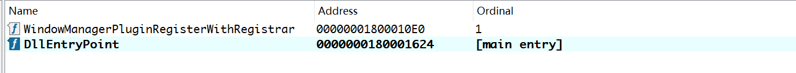
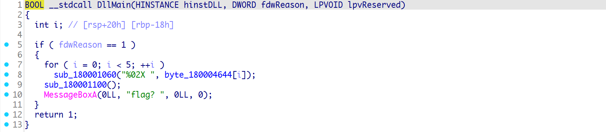
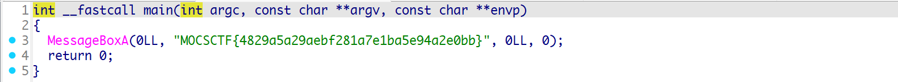

## MalRev

题目涉及来源于最近常见且猖獗的恶意黑产软件，黑猫、银狐、钓鱼等；此类恶意软件设计思路为白+黑方式，即在已有软件的基础上将黑文件掺入，达到C2控制目的。

## 解题思路

### 运行查看

运行程序查看，依次出现如下弹窗 can you find the flag? 说明dll被劫持了；



查看程序为x64，将exe文件拖入IDA，看导入表；程序自定义的导入dll如下；


### 依次查看dll获取key

#### clipboard_watcher_plugin.dll

导出表



查看函数，典型的白加黑测试；


返回看主函数


跟进



跟进，clipboard_watcher_plugin，第一个弹窗在这里；


发现算法和数据


进行异或的值


异或结果

```c
{0xB9, 0xF9, 0xB9, 0x6A, 0xA4}
```

依次跟进剩余dll

#### desktop_multi_window_plugin.dll




异或结果

```c
{0x9F, 0xF8, 0xD9, 0x25, 0x0C}

```

#### flutter_webrtc_plugin.dll






异或结果

```c
{0x92, 0xF7, 0xD4, 0x2E, 0x09}

```

#### screen_retriever_plugin.dll





异或结果

```c
{0xBA, 0xDF, 0xDC, 0x20, 0x09}

```

#### window_manager_plugin.dll






异或结果

```c
{0xEA, 0xDF, 0xBC, 0x20, 0x59}
```

题目中有个encrypt文件，猜测是用key进行解密；这里就是异或，不过异或key是上述连接；

```c
0xB9,0xF9,0xB9,0x6A,0xA4,0x9F,0xF8,0xD9,0x25,0x0C,0x92,0xF7,0xD4,0x2E,0x09,0xBA,0xDF,0xDC,0x20,0x09,0xEA,0xDF,0xBC,0x20,0x59
```

### XOR解密encrypt文件


解密后查看文件发现是exe文件


执行或拖入IDA拿到flag



```c
MOCSCTF{4829a5a29aebf281a7e1ba5e94a2e0bb}
```


