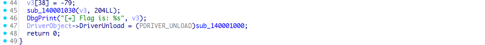
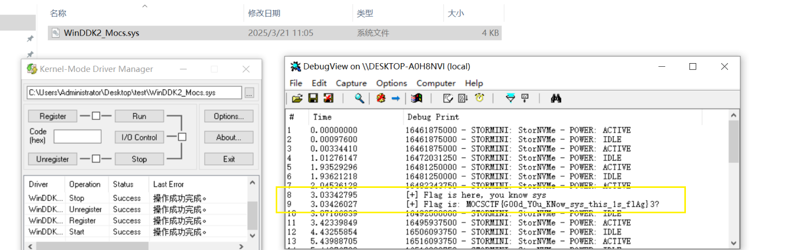
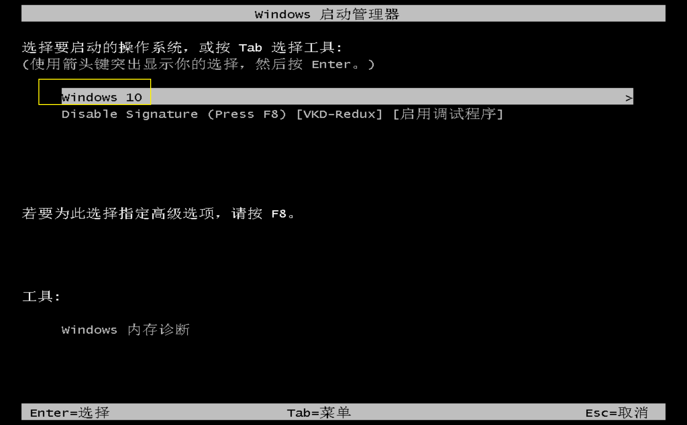

## flag

MOCSCTF{G00d_Y0u_KNow_sys_this_1s_flAg}

## 解題步驟

1個考點：驅動加載

此文件考察driver基礎知識，只要將驅動註冊，加載，運行，即可獲取flag；如果不懂驅動知識，可以逆向分析；

演算法簡單，就是xor；

1. 方法1：驅動程式加載

2. 方法2：還原程式碼

**windows驅動基礎** (請在虛擬機上操作)

最近學習windows內核，以下題目是driver程序，逆向也可以分析出來，但目的是為了讓大家學習driver入門；

vm啟動按F8

禁用簽名；

涉及軟體Dbgview和kdm的使用；
