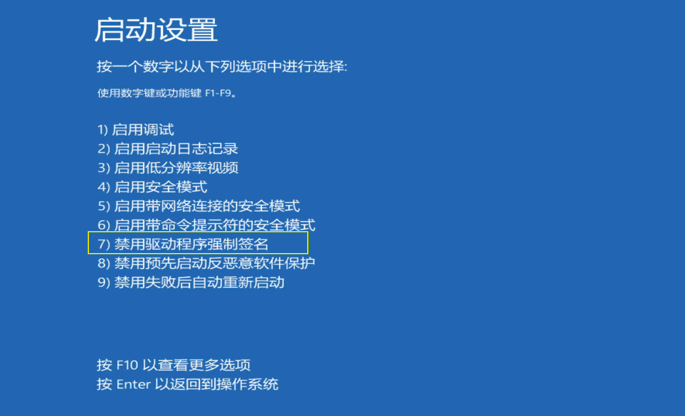
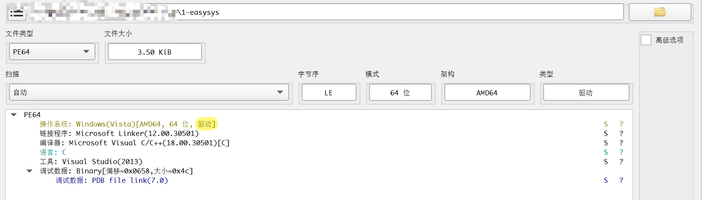
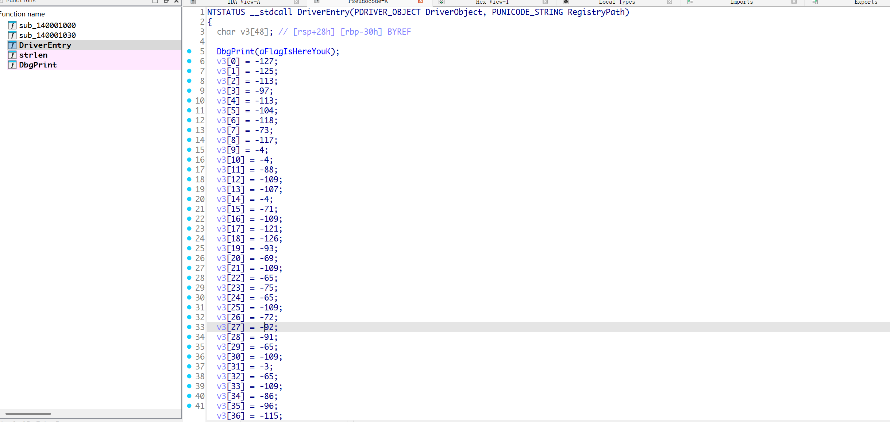
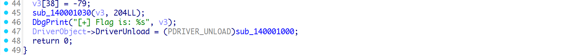
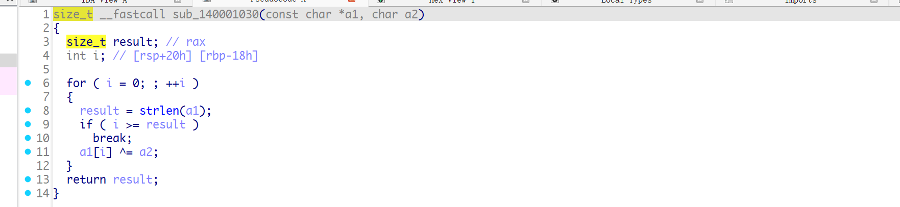
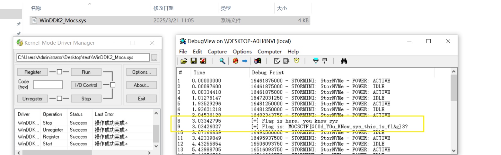
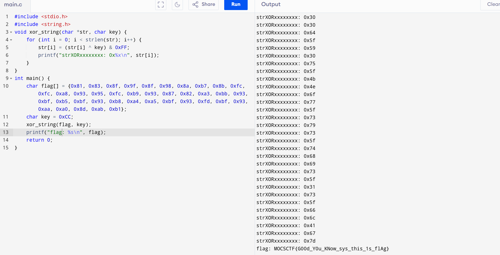

# Content

windows驱动基础

最近学习windows内核，如下题目是driver程序，逆向也可以分析出来，但是目的是为了让大家学习driver入门；

vm启动按F8


禁用签名；



涉及软件Dbgview和kdm的使用；

## 1-easysys

1个考点：驱动加载

此文件考察driver基础知识，只要将驱动注册，加载，运行，即可获取flag；如果不懂驱动知识，可以逆向分析；

```c
MOCSCTF{G00d_Y0u_KNow_sys_this_1s_flAg}
```





算法简单，就是xor；





### 方法1：驱动加载



### 方法2：还原代码


