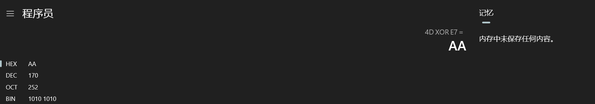
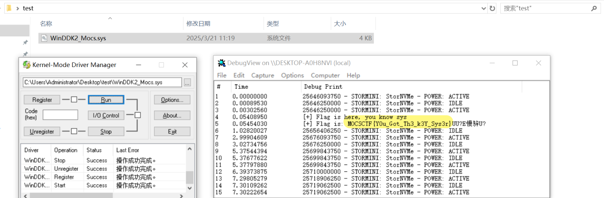
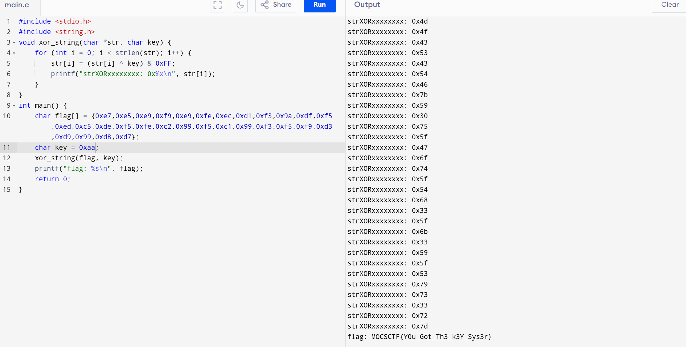

## flag

MOCSCTF{Y0u_Got_Th3_k3Y_Sys3r}

## 解題步驟

2個考點：驅動程式載入和patch還原

```c
MOCSCTF{Y0u_Got_Th3_k3Y_Sys3r}
```

與上題目easysys類似，但patch掉了加密key,patch為0；因為flag的首字母是M，將M與第一個字元xor，取得key為0xaa；或直接爆破拿到flag;




### 方法1：載入執行



### 方法2：還原程式碼




**windows驅動基礎** (請在虛擬機上操作)

最近學習windows內核，以下題目是driver程序，逆向也可以分析出來，但目的是為了讓大家學習driver入門；

vm啟動按F8


禁用簽名；


涉及軟體Dbgview和kdm的使用；
