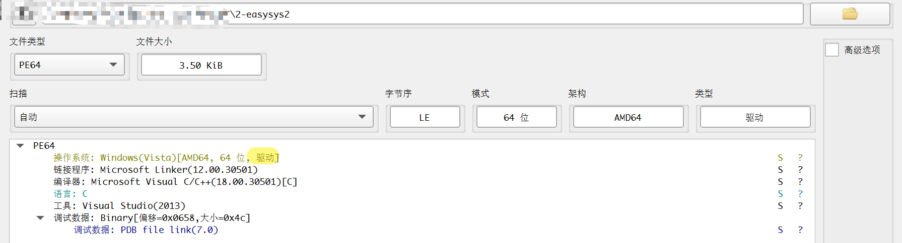
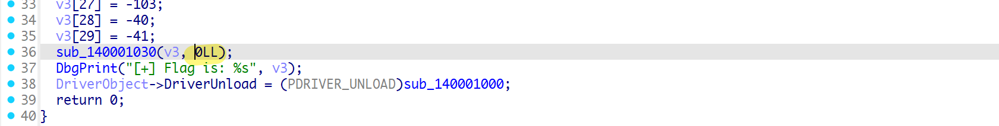
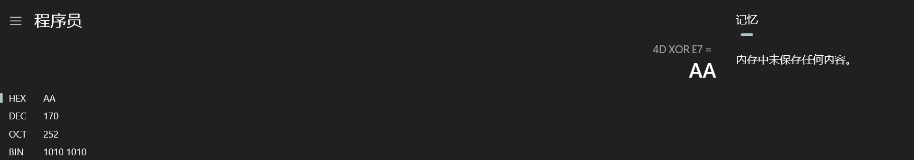
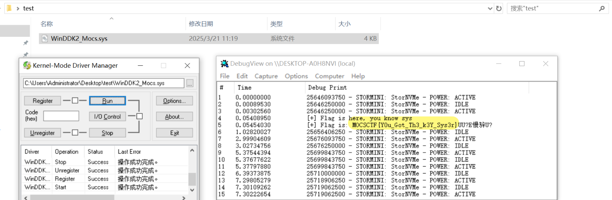
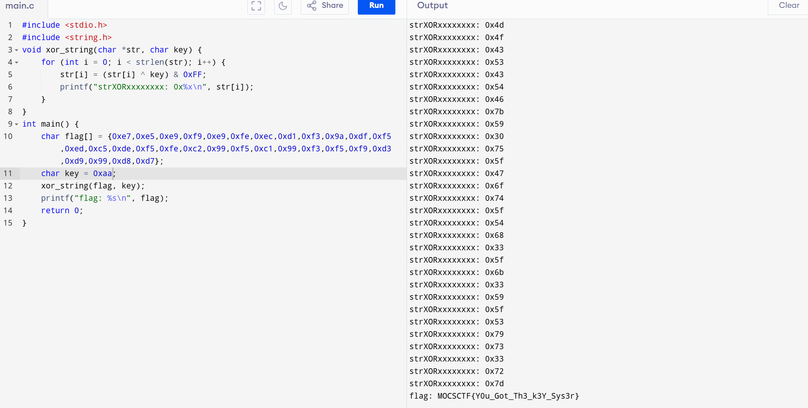

# Content

windows驱动基础

最近学习windows内核，如下题目是driver程序，逆向也可以分析出来，但是目的是为了让大家学习driver入门；

vm启动按F8


禁用签名；


涉及软件Dbgview和kdm的使用；

## 2-easysys2

2个考点：驱动加载和patch还原

```c
MOCSCTF{Y0u_Got_Th3_k3Y_Sys3r}
```

与上题目类似，但是patch掉了加密key,patch为0；因为flag的首字母是M，将M与第一个字符xor，获取key为0xaa；或者直接爆破拿到flag;







### 方法1：加载执行



### 方法2：还原代码


