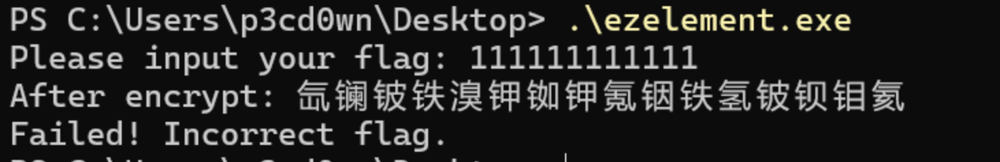
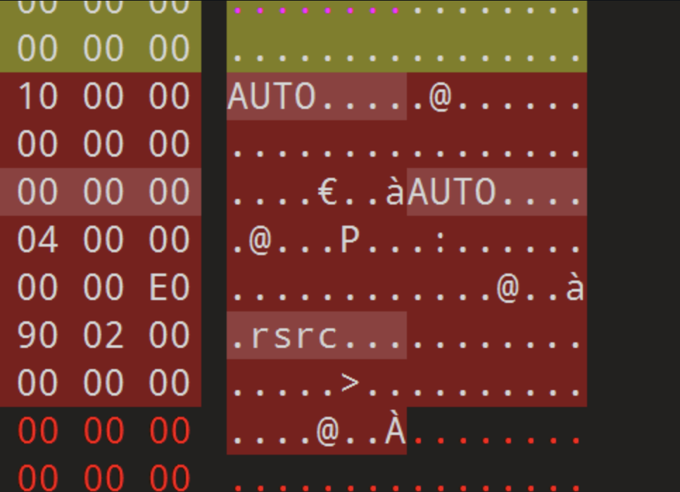
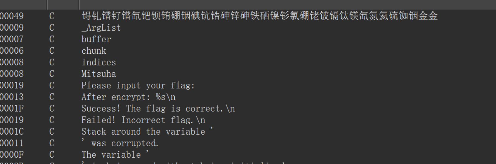
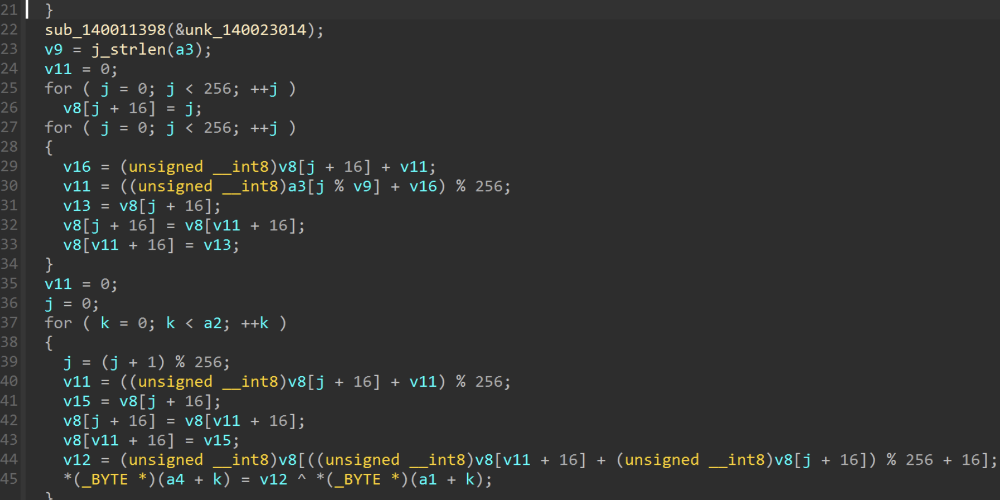
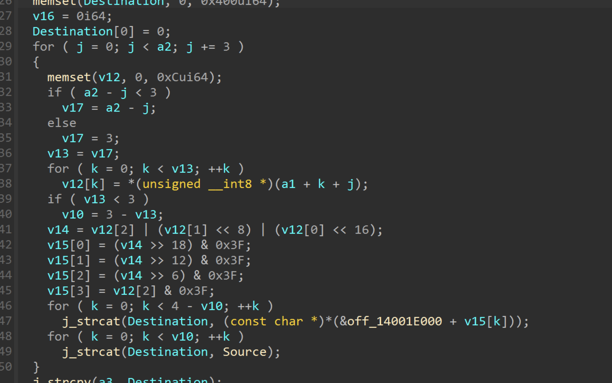
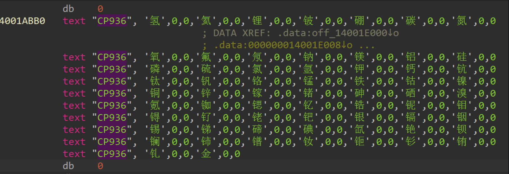

## flag

MOCSCTF{El3m3nt_1s_E4sy!}

## 解題步驟

1.嘗試執行程序，發現程式會輸出加密後的結果，以元素的形式輸出，然後告知驗證是否成功



2.die查殼，發現是upx殼但是modified


3. 010查看魔改的部分



4. UPX0 UPX1 UPX！都改成了AUTO，改回來即可正常脫殼（實際版本是4.23）

3.upx -d脫殼得到目標程序

5. 透過字串定義找到主函數



6. 主函數裡面定義了兩個加密，一個rc4一個base64





7. 但注意到base64的表做了替換，換成了中文元素（CP396格式顯示就能看到中文）



8. rc4的金鑰是Misuha，base64的碼表是氢氦锂铍硼碳氮氧氟氖钠镁铝硅磷硫氯氩钾钙钪钛钒铬锰铁钴镍铜锌镓锗砷硒溴氪铷锶钇锆铌钼锝钌铑钯银镉铟锡锑碲碘氙铯钡镧铈镨钕钷钐铕钆，金相当于替换了=

9. 我們先解base64，然後解rc4，即可得到flag

exp如下：

```python
def rc4(data, key):
    S = list(range(256))
    j = 0
    key_bytes = key.encode('utf-8')
    
    for i in range(256):
        j = (j + S[i] + key_bytes[i % len(key_bytes)]) % 256
        S[i], S[j] = S[j], S[i]
    
    i = j = 0
    out = bytearray()
    for char in data:
        i = (i + 1) % 256
        j = (j + S[i]) % 256
        S[i], S[j] = S[j], S[i]
        k = S[(S[i] + S[j]) % 256]
        out.append(char ^ k)
    
    return bytes(out)

def base64_custom_decode(encoded_str):
    base64_chars = "ABCDEFGHIJKLMNOPQRSTUVWXYZabcdefghijklmnopqrstuvwxyz0123456789+/"
    chinese_table = "氢氦锂铍硼碳氮氧氟氖钠镁铝硅磷硫氯氩钾钙钪钛钒铬锰铁钴镍铜锌镓锗砷硒溴氪铷锶钇锆铌钼锝钌铑钯银镉铟锡锑碲碘氙铯钡镧铈镨钕钷钐铕钆"
    
    char_to_index = {char: idx for idx, char in enumerate(chinese_table)}
    char_to_index['金'] = 0  
    
    data = bytearray()
    padding_count = 0
    
    for i in range(0, len(encoded_str), 4):
        chunk = encoded_str[i:i+4]
        
        padding_count = 0
        indices = []
        for char in chunk:
            if char == '金':
                padding_count += 1
                indices.append(0)
            else:
                if char in char_to_index:
                    indices.append(char_to_index[char])
        
        while len(indices) < 4:
            indices.append(0)
        
        n = (indices[0] << 18) | (indices[1] << 12) | (indices[2] << 6) | indices[3]
        
        bytes_to_add = [
            (n >> 16) & 0xFF,
            (n >> 8) & 0xFF,
            n & 0xFF
        ]
        
        if padding_count > 0:
            bytes_to_add = bytes_to_add[:3 - padding_count]
        
        data.extend(bytes_to_add)
    
    return bytes(data)

def decrypt_custom_base64(encoded_str, key):
    encrypted_data = base64_custom_decode(encoded_str)
    
    decrypted = rc4(encrypted_data, key)
    
    return decrypted.decode('utf-8')

if __name__ == "__main__":
    encoded_str = "锝钆镨钌镨氙钯钡铕硼铟碘钪锆砷锌砷铁硒镍钐氯硼铑铍镉钛镁氙氮氦硫铷铟金金"
    key = "Mitsuha"
    
    decrypted_text = decrypt_custom_base64(encoded_str, key)
    print(f"{decrypted_text}")
```