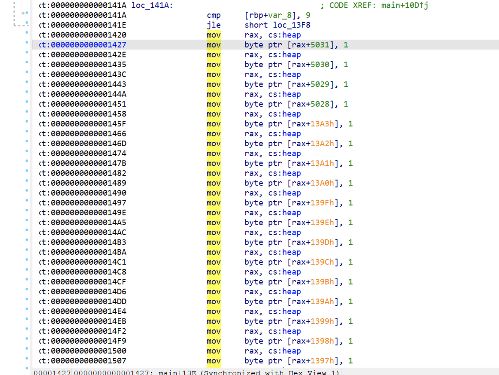
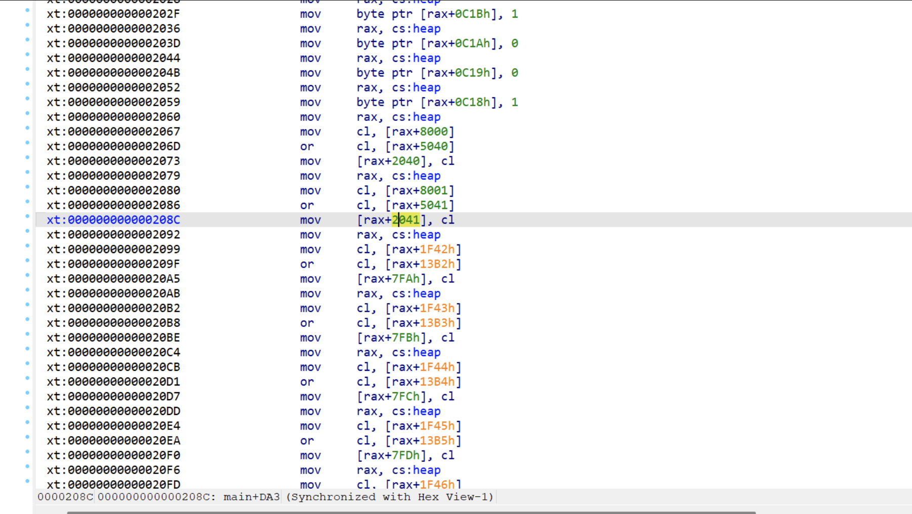
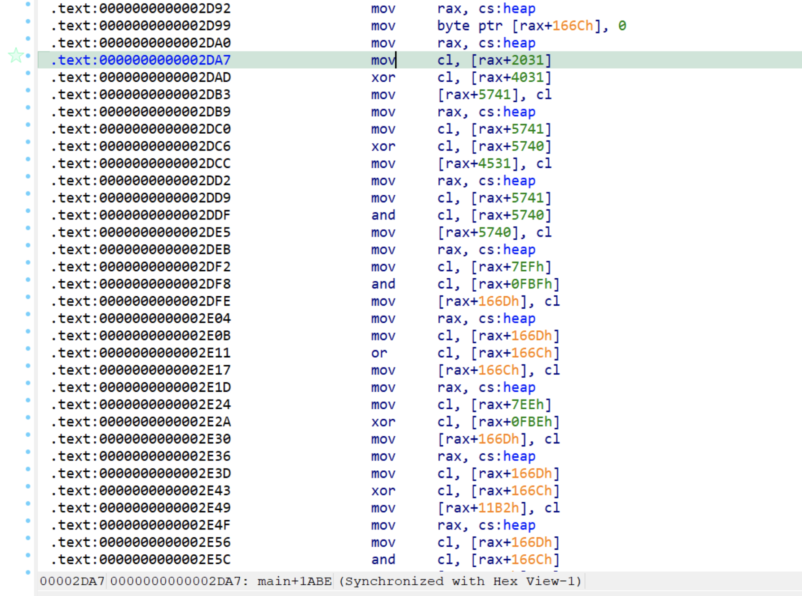
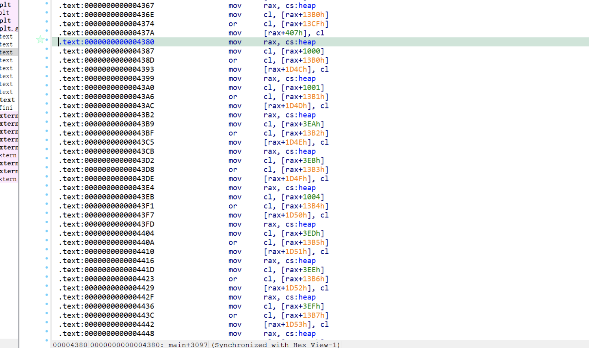
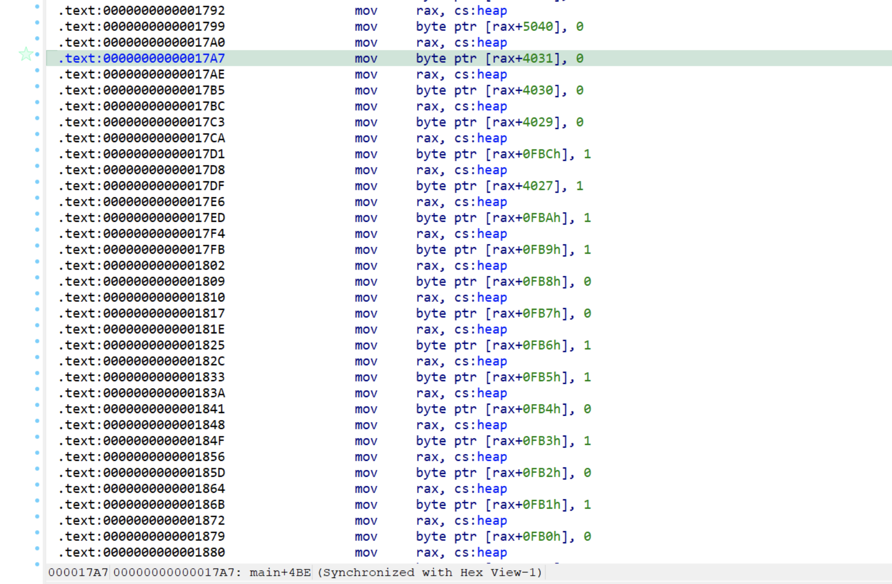
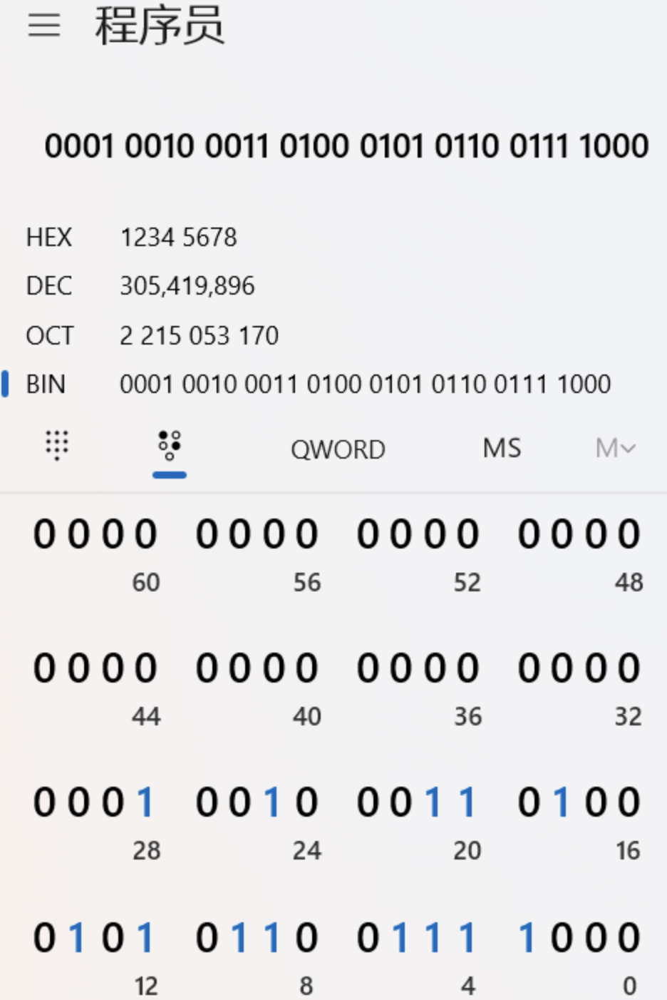
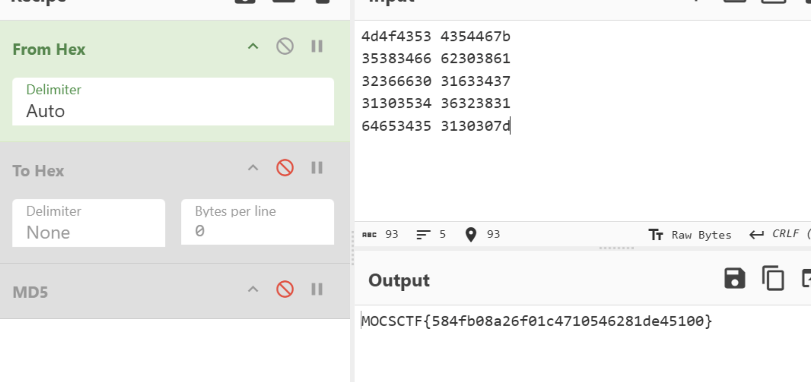

## flag

MOCSCTF{584fb08a26f01c4710546281de45100}

## 解題步驟

演算法是魔改tea演算法，其實關鍵還是怎麼去理解分析這個虛擬機

完全是用位元運算實現的虛擬機，這些運算都在堆中實現

舉一個例子來分析數據



這裡就是堆中的heap[5000]~heap[5031]這32個位元組賦值0或1，heap[5031]是高位，heap[5031]是低位

這裡就相當於把heap[5000]~heap[5031]都置1了，這就是全1寄存器，heap[5040]~heap[5071]是全0寄存器

再分析資料讀取於存放的程式碼，其實10個32位元值存到了和heap[8000]的位置，最後取資料也是從heap[8000]取出來的


對每一個32位的計算過程來對heap[8000]處的數據分析其變化即可知道每一個過程做了什麼

舉例：

這裡就是將heap[8000]的前8位元組資料讀取複製到2040和2080



這一部分實際上實現的就是加法



左移右移是用or邏輯實現的，如這裡就是左移，與全0寄存器的或運算來實現



再分析其實能發現delta_reg在heap[4000]處



00010010001101000101011001111000



分析連續賦值3*4位元組的，發現key是在heap[3000]的位置，可取到

key = [0x12345678, 0x9abcdef0, 0x12345678, 0x9abcdef0]

exp如下

```
#include <stdint.h>
#include <stdio.h>

#define DELTA 0x12345678
#define ROUNDS 32
void tea_decrypt(uint32_t *v, uint32_t *key) {
    uint32_t v0 = v[0], v1 = v[1], sum = DELTA * ROUNDS;
    for (int i = 0; i < ROUNDS; i++) {
        v1 -= ((v0 << 4) + key[2]) ^ (v0 + sum) ^ ((v0 >> 5) + key[3]);
        v0 -= ((v1 << 4) + key[0]) ^ (v1 + sum) ^ ((v1 >> 5) + key[1]);
        sum -= DELTA;
    }
    v[0] = v0;
    v[1] = v1;
}
int main() {
    uint32_t key[4] = {0x12345678, 0x9abcdef0, 0x12345678, 0x9abcdef0};
    uint32_t data1[10] = { 0x2f899590 ,0x90c06101
            ,0x358a1ace ,0x1ac88163
            ,0x5372dec9 ,0xe394bd7f
            ,0x6f3c38aa ,0x4934dddb
            ,0xed39a48e ,0x699afa89};
    // Decrypt all data blocks
    for (int i = 0; i < 10; i += 2) {
        tea_decrypt(&data1[i], key);
    }

    printf("\nDecrypted data:\n");
    for (int i = 0; i < 10; i += 2) {
        printf("%08x %08x\n", data1[i], data1[i + 1]);
    }

    return 0;
}
```




