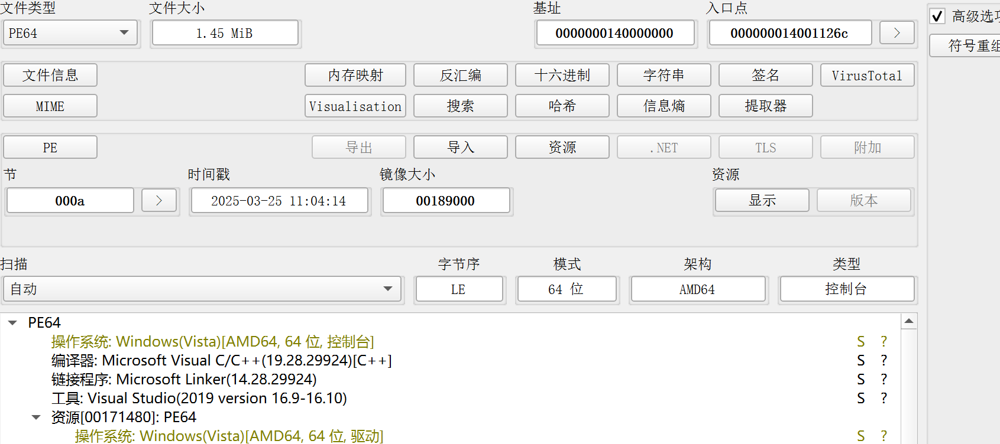
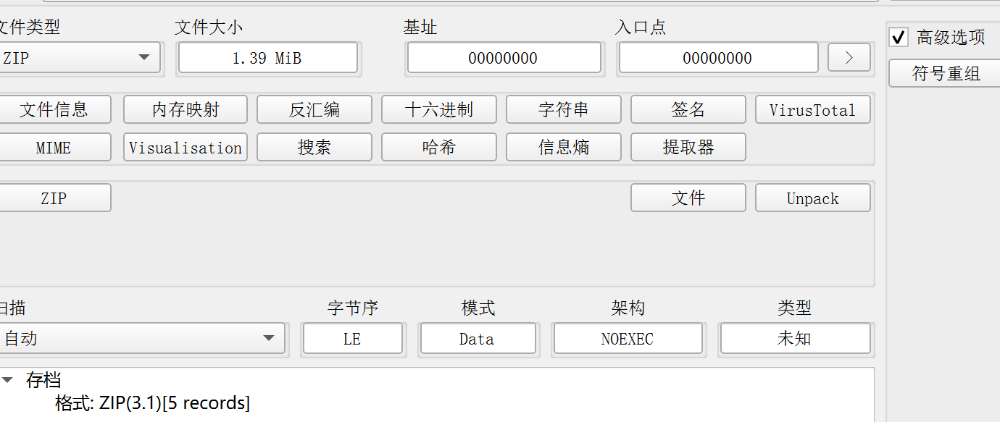
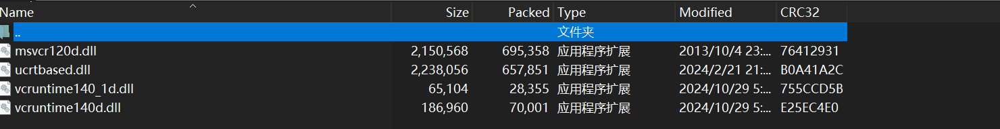
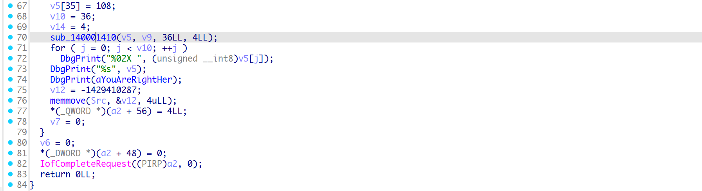

## flag

MOCSCTF{R3_0_Good_Y0u_F1nd_R1tkey!!}

## 解題步驟

1. 方法1：驅動加載

解題過程



看到有資源文件


其中0文件如下


MAYBEUSEINDEBUG檔案如下



改成sys、exe、zip文件，將壓縮包解壓縮；壓縮包是幾個dll；



沒有這幾個dll會顯示類似如下報錯，不用這些在自己系統中找下也可以；


載入運行拿到flag；


2. 方法2：逆向工程

這個是發送過去的key


直接輸出的是迷惑key；


r0環進行flag解密；




異或解密；


```c
#include <stdio.h>
#include <string.h>

void xor_string(char *str, const char *key, int key_len) {
    int str_len = strlen(str);
    for (int i = 0; i < str_len; i++) {
        str[i] ^= key[i % key_len]; // 循环使用密钥
    }
}

int main() {
    char key[] = {0xcc, 0x22, 0xaa, 0x11};
    char flag[] = {0x81, 0x6d, 0xe9, 0x42, 0x8f, 0x76, 0xec, 0x6a, 0x9e, 0x11, 0xf5, 0x21, 0x93, 0x65, 0xc5, 0x7e, 0xa8, 0x7d, 0xf3, 0x21, 0xb9, 0x7d, 0xec, 0x20, 0xa2, 0x46, 0xf5, 0x43, 0xfd, 0x56, 0xc1, 0x74, 0xb5, 0x3, 0x8b, 0x6c}; // 密钥数组
    int key_len = sizeof(key); // 计算密钥数组的长度

    // 异或操作
    xor_string(flag, key, key_len);

    // 输出异或后的结果
        printf("Flag:%s\n", flag);

    return 0;
}
```
