# Content

windows驱动基础

最近学习windows内核，如下题目是driver程序，逆向也可以分析出来，但是目的是为了让大家学习driver入门；

vm启动按F8

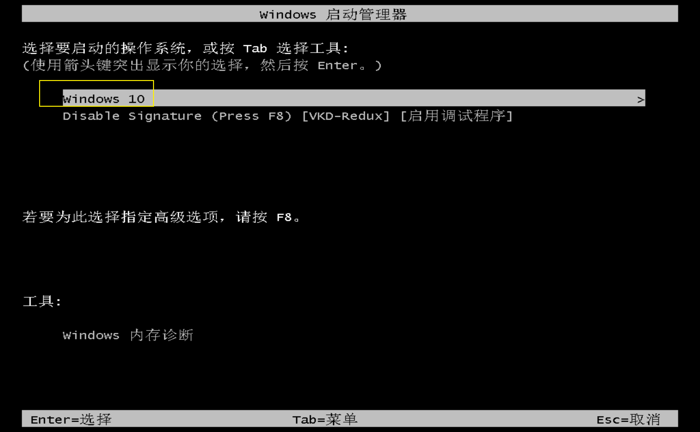

禁用签名；

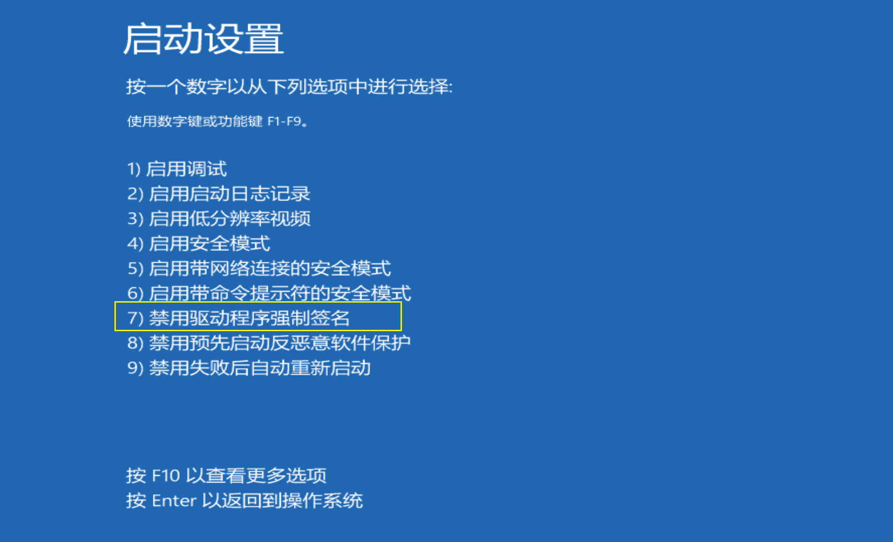

涉及软件Dbgview和kdm的使用；

## 4-r3r0

3个考点：驱动加载，此题目涉及R0-R3通信，0环进行解密；

```c
MOCSCTF{R3_0_Good_Y0u_F1nd_R1tkey!!}
```

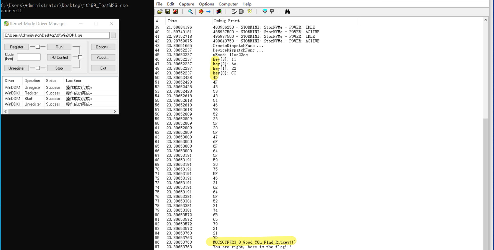

### 方法1：驱动加载

解题过程

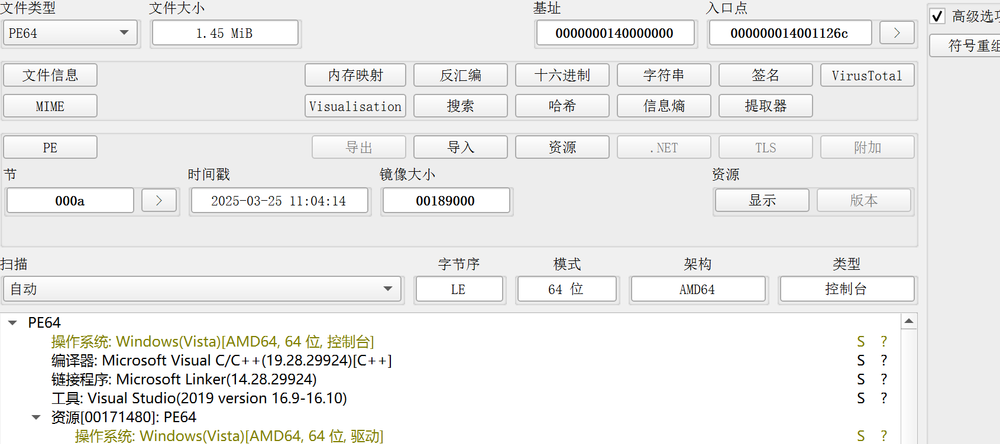

看到有资源文件

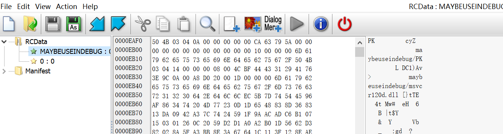

其中0文件如下

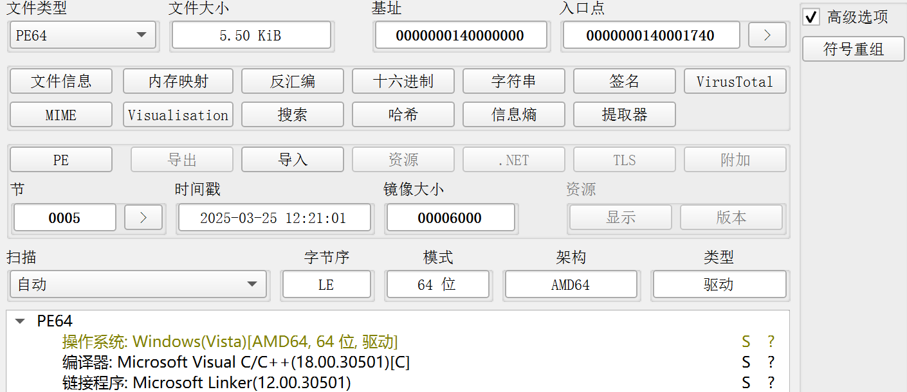

MAYBEUSEINDEBUG文件如下

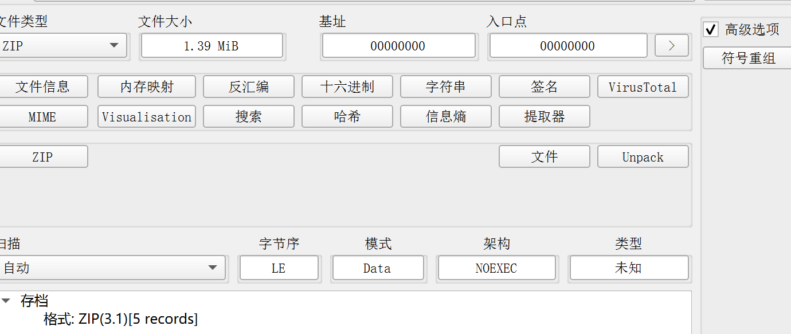

改成sys、exe、zip文件，将压缩包解压；压缩包是几个dll；

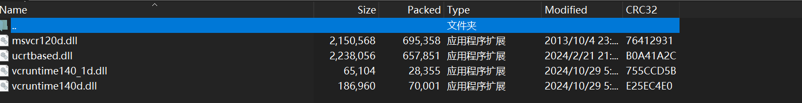

没有这几个dll会显示类似如下报错，不用这些在自己系统中找下也可以；

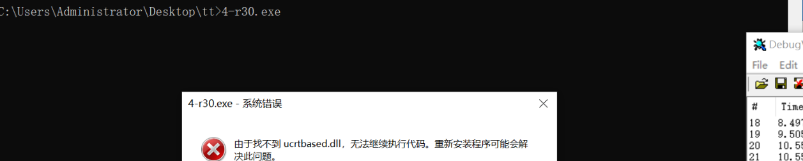

加载运行拿到flag；

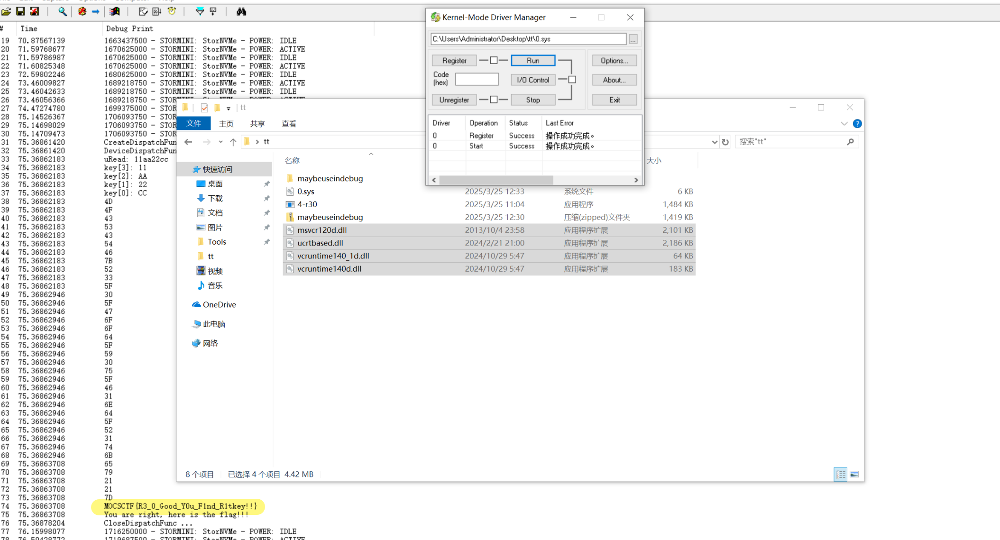

### 方法2：逆向工程

这个是发送过去的key

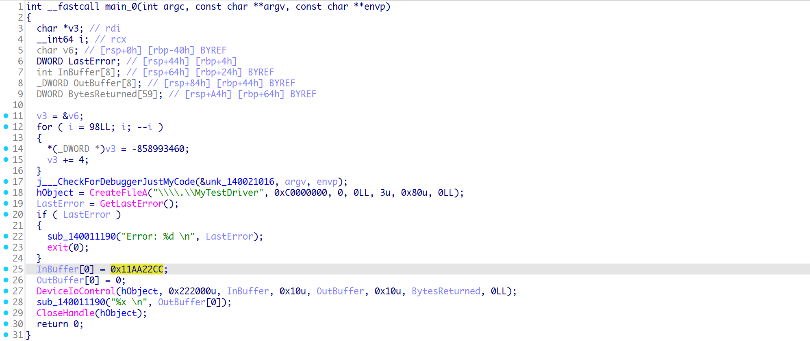

直接输出的是迷惑key；

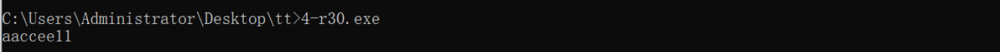

r0环进行flag解密；

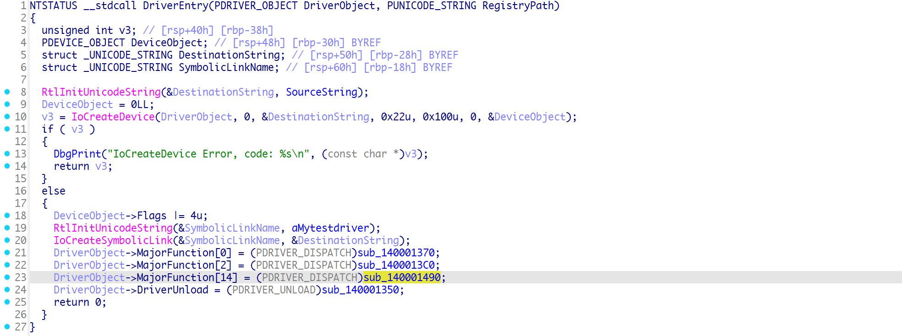

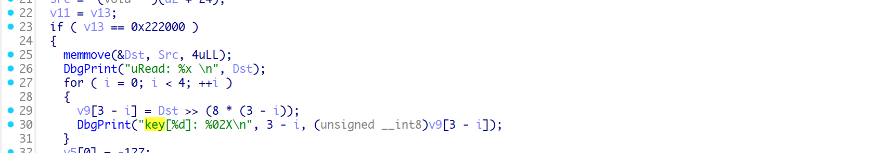

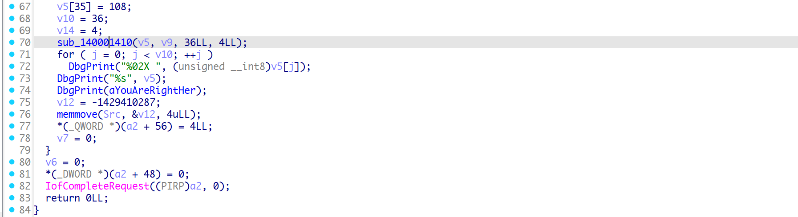

异或解密；

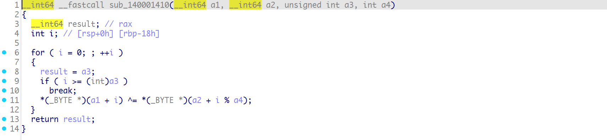

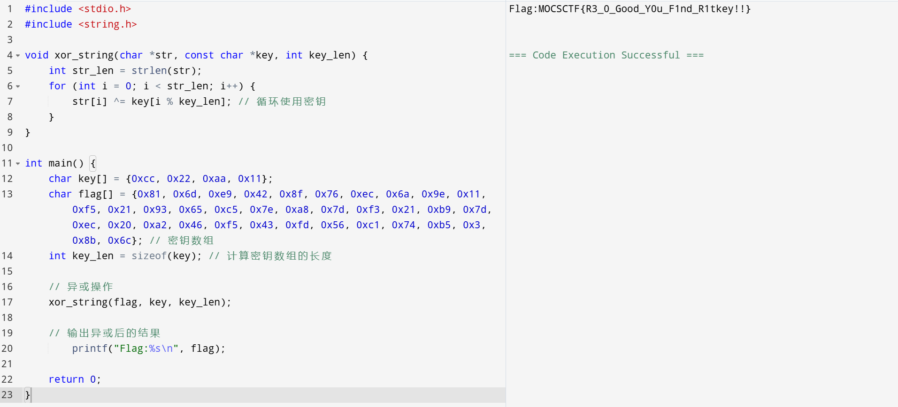

```c
#include <stdio.h>
#include <string.h>

void xor_string(char *str, const char *key, int key_len) {
    int str_len = strlen(str);
    for (int i = 0; i < str_len; i++) {
        str[i] ^= key[i % key_len]; // 循环使用密钥
    }
}

int main() {
    char key[] = {0xcc, 0x22, 0xaa, 0x11};
    char flag[] = {0x81, 0x6d, 0xe9, 0x42, 0x8f, 0x76, 0xec, 0x6a, 0x9e, 0x11, 0xf5, 0x21, 0x93, 0x65, 0xc5, 0x7e, 0xa8, 0x7d, 0xf3, 0x21, 0xb9, 0x7d, 0xec, 0x20, 0xa2, 0x46, 0xf5, 0x43, 0xfd, 0x56, 0xc1, 0x74, 0xb5, 0x3, 0x8b, 0x6c}; // 密钥数组
    int key_len = sizeof(key); // 计算密钥数组的长度

    // 异或操作
    xor_string(flag, key, key_len);

    // 输出异或后的结果
        printf("Flag:%s\n", flag);

    return 0;
}
```
