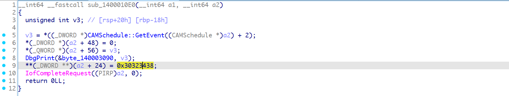
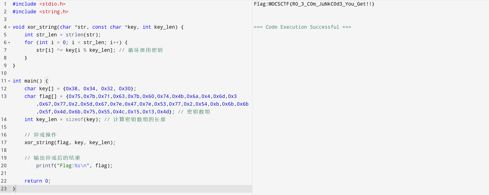

## flag

MOCSCTF{R0_3_C0m_JuNkC0d3_You_Get!!}

## 解題步驟

1. 查看檔案屬性


2. 運行看看


3. 既然提示了找windows的驅動文件，看下資源；


4. 看下兩個資源，41和42，因為驅動文件都是PE文件，PE頭是4D5A，顯然數據被加密了；文件名稱為xxoorr，這也是個提示；


5. 嘗試異或找到兩個檔案的key是0xcc和0xaa；使用010還原檔；


5. 看到了


6. 可依上一題r30題目進行逆向或驅動載入取得flag；與上一題r30題目的加密key不同；找到加密key；




7. 之後獲取flag;

```c
#include <stdio.h>
#include <string.h>

void xor_string(char *str, const char *key, int key_len) {
    int str_len = strlen(str);
    for (int i = 0; i < str_len; i++) {
        str[i] ^= key[i % key_len]; // 循环使用密钥
    }
}

int main() {
    char key[] = {0x38, 0x34, 0x32, 0x30}; 
    char flag[] = {0x75,0x7b,0x71,0x63,0x7b,0x60,0x74,0x4b,0x6a,0x4,0x6d,0x3,0x67,0x77,0x2,0x5d,0x67,0x7e,0x47,0x7e,0x53,0x77,0x2,0x54,0xb,0x6b,0x6b,0x5f,0x4d,0x6b,0x75,0x55,0x4c,0x15,0x13,0x4d}; // 密钥数组
    int key_len = sizeof(key); // 计算密钥数组的长度

    // 异或操作
    xor_string(flag, key, key_len);

    // 输出异或后的结果
        printf("Flag:%s\n", flag);

    return 0;
}
```


