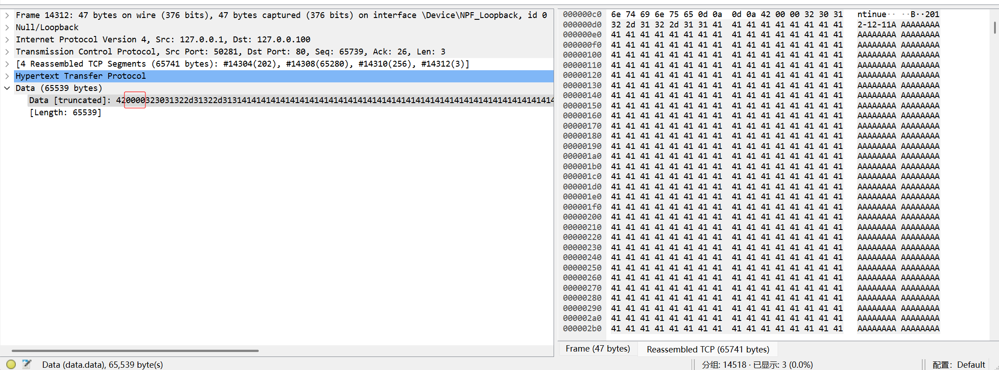
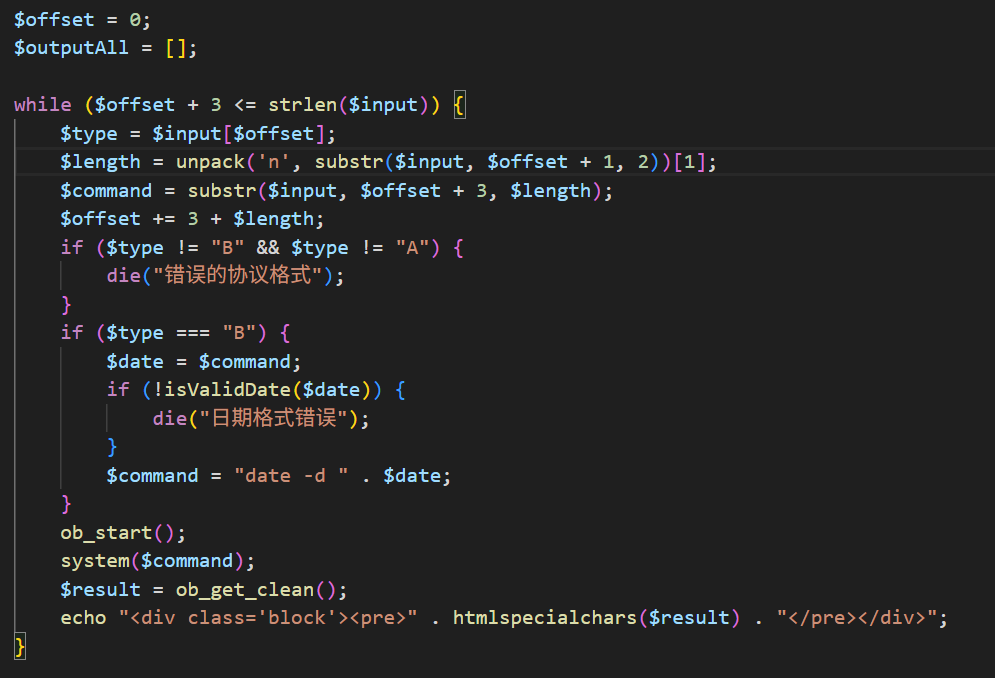
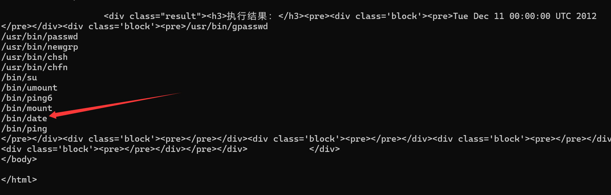

## flag

MOCSCTF{!njEc7_1t_@t_the_Pr0TOC01_L4yER}

## 解題步驟

1. 直接存取頁面，會顯示簽名驗證失敗，拒絕存取：


2. 直接定位到程式碼的部分，可以發現簽名的邏輯其實是判斷你的請求頭裡是不是帶了X-Signature字段，然後用這個字段解碼後和$Secret_Key進行比較：


3. 但這裡的checkSignature函數以及verifySignature函數的驗證配合存在一個嚴重的邏輯缺陷，checkSignature只是在能正常解碼的時候把簽名和$Secret_Key進行比較，返回真或者假，而verifySignature只有在checkSignature返回假的時候才退出，否則預設回傳真，那麼這裡我們其實只需要建構一個錯誤的base64編碼，例如@@@，讓checkSignature解碼錯誤，那麼該函數就會拋出錯誤，不會回傳假，verifySignature也能正常通過：

```
GET / HTTP/1.1
Host: localhost:9999
X-Signature:@@@
User-Agent: Mozilla/5.0 (Windows NT 10.0; Win64; x64; rv:137.0) Gecko/20100101 Firefox/137.0
Accept: text/html,application/xhtml+xml,application/xml;q=0.9,*/*;q=0.8
Accept-Language: zh-CN,zh;q=0.8,zh-TW;q=0.7,zh-HK;q=0.5,en-US;q=0.3,en;q=0.2
Accept-Encoding: gzip, deflate, br
Connection: close
Upgrade-Insecure-Requests: 1
Priority: u=0, i
```


4. 接著分析原始碼可以看出來，這個功能介面其實是有三個功能，後兩個功能需要傳入一個日期，而功能一什麼也不需要傳入：


5. 這裡index.php和execute.php透過建構的二進位協定進行傳輸，建構邏輯是：標誌欄位+指令長度+實際的指令


6. 在execute.php中會先判斷來源是否為index.php，判斷成功後對傳入的二進位協定進行解析，若標誌欄位是A，直接執行指令，若標誌欄位是B，則會判斷傳入的指令是否為合法的日期格式，判斷成功後拼接date -d執行，否則退出


7. 這裡我們本地抓一下查看日期的包，看一下二進位協定的構造細節：


8. 可以看到傳入的二進位資料是：

```
42000a323031322d31322d3131
```

9. 其中42是B的十六進制，代表了這次協議的標誌B，000a代表了這次請求載荷的長度是10，後面的323031322d31322d3131就是實際載荷2012-12-21

10. 這裡我們可以嘗試惡意建構一個錯誤的數據，例如在2012-12-21後面加10個A，可以看到此時的長度就變成了0014，也就是20，這證明我們惡意構造一個比較長的數，這個長度字段確實會隨之增長：


11. 只不過後端這裡存在校驗，判斷到你的標頭是B，會用你的載荷對比是否是合法的日期，不是的話還是不能執行，除非標頭是A才會直接執行，但我們並沒有可控點：


12. 但這裡有一個很有趣的點，因為發送的長度字段是直接len的載荷，雖然我們的命令不符合日期可能不能直接執行，但我們現在確實能直接控制長度字段的長度。我們回看這個協議，這個 `pack('n', strlen($command))` 是什麼意思呢？其實是取得`$command` 這段字串的長度接著按照16位元（2位元組）無符號整數打包成二進位資料：


13. 16位也就是我們之前看到的000a，而16位無符號整數其實有上限的，它的上限就是ffff，如果我們再給它加1，它就會變成10000，而經過16位的截斷，實際上寫入協議的長度就變成了0000。我們不妨做個實驗，16位元無符號整數的最大值是65536，而原本的載重2012-12-11的長度是10，理論上我們只要再在2012-12-11的後面加65526個A，那麼現在寫入協定的長度欄位就應該變成0000，而事實也應該變成了



14. 尤里卡！現在我們已經能任意控制這個長度字段了，我們再回看後端解析協議的邏輯，它其實就是根據這個長度字段解析載荷，然後繼續按著類似的邏輯解析下一個二進制協議，直到整個請求解析結束：



15. 那麼思路其實已經很明顯了，因為只有標頭為A的二進制協議才能正常執行，那麼我們只需要構造一個標頭為A的可以執行命令的二進制協議，將他放在2012-12-11的後面，然後填充A，保證第一個協議截斷後恰好是一個合法的以A開頭的協議，那麼就會執行成功了我們的協議，那麼就會執行了任意命令！

16. 這裡我們直接執行ls -al /，可以發現我們現在沒有讀取flag的權限，還需要提一下權：


17. 這裡我們用`find / -perm -u=s -type f 2>/dev/null`查一下suid，可以發現date存在suid提權的可能：



18. 不過這裡我們如果直接使用`date -f /f*`在頁面上其實是看不到輸出的：


19. 回看網頁程式碼裡執行程式碼的邏輯，它其實是讀取了緩衝區的結果進行輸出，錯誤訊息(我們的`date -f`執行得到的就是錯誤訊息)通常會輸出到標準錯誤流（`stderr`）中，而不會寫入到標準輸出流（`stdout`）中。


20. 因此要想在頁面上看到輸出，我們需要把錯誤訊息也輸出到緩衝區，最後能打通的payload其實是`date -f /f* 2>&1`，不過再傳POST的時候還需要對&特殊處理一下，否則解析會出錯，比如我的exp.py裡是直接base64了，最後我們終於可以讀取flag了：

